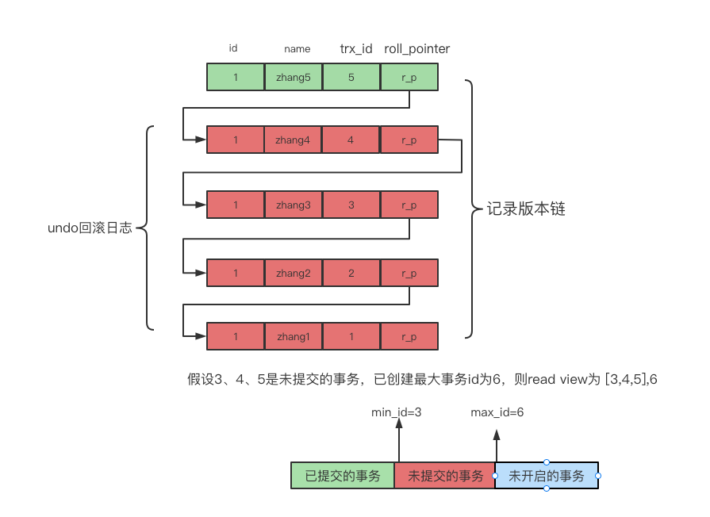

# [深入理解MVCC](../README.md)

[TOC]

## 一 什么是mvcc机制？

首先了解一下repeatable-read（可重复读）和serializable（可串行化）：

+ repeatable-read：可重复读就是在同一个事务中，在不同的时间段执行相同的查询语句，所得结果是相同。
+ serializable：当事务隔离级别在serializable级别时，mysql在读写的过程中对所涉及行的数据都会加锁，其他事务对于这些数据的读写操作都会阻塞。

可重复读和串行化都是为了保证多次读到的数据一致，确保隔离性。串行化是通过对读写操作进行加锁来实现数据一致性，而可重复读是通过`MVCC(Multi-Version Concurrency Control)`多版本并发控制来保证数据一致性的。

## 二 MVCC实现原理

 	mysql中mvcc是通过`undo log`日志版本链和`read view`一致性视图来实现的。

### 1 undo日志版本链

​	undo日志版本链是mysql记录某个时间历次被修改的版本，并通过`roll_pointer`(回滚指针)连接的。当发生数据回滚时可以通过undo日志版本链来恢复到之前的数据。

### 2 read view机制

read view一致性视图生成机制：

+ 在可重复读的隔离级别中，在一个事务中第一次执行SELECT语句的时候mysql会帮我们生成一个`read view`，生成的这个`read view`在本次事务结束之前是都不会产生变化的。这里需要注意的是`begin`开启事务的时候是不会生成read view的，只有在执行第一个SELECT语句时才会生成。
+ 在读已提交的隔离级别中，每一次执行SELECT语句都会重新生成一个新的`read view`。

read view一般是由两部分组成的，第一部分是由执行SELECT语句时**所有未提交的事务ID**的集合组成(数组中最小的id为min_id)。第二部分是由**已创建的最大的事务ID**组成（max_id）。

### 3 undo日志版本链和read view对比规则

从图中的处min_id=3,max_id=6（原则上max_id是要比已创建的最大事务id还要大一位），对比规则：

+ 如果trx_id<min_id,则表示这个版本是已提交事务生成的，这个数据是可见的；
+ 如果trx_id>max_id,则表示这个版本是由将来启动的事务生成，是不可见的（原则上如果max_id=自己本本身的trx_id则是可见的）；
+ 如果min_id<=trx_id<=max_id,则分为两种情况：
  + 若row在trx_id的视图数组中，则表示为未提交的事务，是不可见的(若 row 的 trx_id 就是当前自己的事务是可见的)；
  + 若row不在trx_id的事务数组中，则表示这个版本是已经提交的事务生成的，是可见的。

`MVCC`机制的实现是通过`undo log`版本链和`read-view`一致性视图对比机制，使用不同的事务会根据数据版本链对比规则读取同一条数据在版本链上不同版本的数据。