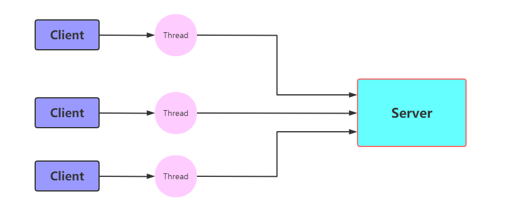
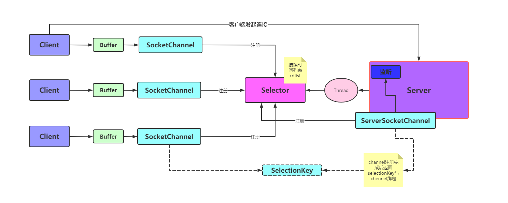

# [BIO、NIO、AIO详解](../README.md)

- [BIO、NIO、AIO详解](#BIO、NIO、AIO详解)
    - [更新日志](#更新日志)
    - [一 IO模型](#一-IO模型)
    - [二 BIO NIO AIO详解](#二-BIO、NIO、AIO详解)
        - [1 BIO(Blocking IO)同步阻塞](#1-BIO(BlockingIO)同步阻塞)
        - [2 NIO(Non Blocking IO)同步非阻塞](#2-NIO(NonBlockingIO)同步非阻塞)
        - [3 LINUX函数详解](#3-LINUX函数详解)
        - [4 AIO异步非阻塞](#4-AIO异步非阻塞)

## 更新日志

| 版本   | 更新说明                                    | 日期       | 更新人 |
| ------ | ------------------------------------------- | ---------- | ------ |
| v1.0.0 | IO模型、BIO/NIO/AIO详解                     | 2021/07/06 | 张子尧 |
## 一 IO模型

I/O输入/输出(Input/Output)，分为*IO*设备和*IO*接口两个部分。IO模型就是说用什么样的通道进行数据的发送和接受，java共支持三种网络IO模式：BIO、NIO、AIO。

## 二 BIO、NIO、AIO详解

### 1 BIO(BlockingIO)同步阻塞

一个客户端连接对应的要有一个线程处理。



**缺点：**

1、bio代码中的read是阻塞操作，如果连接不做数据的读写操作就会导致整个线程阻塞，浪费资源。

2、从上图中我们可以发现，如何存在很多客户端进行io操作，就导致服务器线程开销太多，压力太大等问题，比如C10等。

```java
/**
 * @author zhangziyao
 */
public class BioSocketServer {
    public static void main(String[] args) throws IOException {
        ServerSocket serverSocket = new ServerSocket(8080);
        while (true) {
            log.info("等待连接======================");
            Socket socket = serverSocket.accept();
            log.info("有客户端连接成功==============");

            new Thread(() -> {
                try {
                    log.info("线程->{}连接成功===========", Thread.currentThread().getId());
                    byte[] bytes = new byte[1024];
                    log.info("服务端准备读取-------");
                    int read = socket.getInputStream().read();

                    if (read != -1) {
                        log.info("接收到的消息为：{}", new java.lang.String(bytes, 0, read));
                        log.info("线程id->{}", Thread.currentThread().getId());
                    }
                    socket.getOutputStream().write("kinssings".getBytes());
                    socket.getOutputStream().flush();
                } catch (IOException e) {
                    log.error("异常信息：", e);
                } finally {
                    try {
                        socket.close();
                    } catch (IOException e) {
                        e.printStackTrace();
                    }
                }
            }).start();
        }
    }
}
```


**应用场景：**

BIO方式适用于连接数目录比较小且固定的架构，这种方式对服务器资源要求比较高，但程序简单易理解。

### 2 NIO(NonBlockingIO)同步非阻塞

NIO就是实现服务器一个线程可以处理多个请求,客户端发送的连接请求都会注册到**selector(多路复用器)**上，然后轮询selector中的IO请求进行处理。
**NIO核心API:**

```JAVA
//创建多路复用器
Selector.open()
//将channel注册到selector上
socketChannel.register(selector,SelectionKey.OP_ACCEPT)
//阻塞等待需要处理的事件
selector.select()
```

```java
/**
 * @author zhangziyao
 */
@Slf4j
public class NioSocketServer {

    public static ExecutorService pool = Executors.newFixedThreadPool(10);

    public static void main(String[] args) throws IOException {
        //创建一个socket通道
        ServerSocketChannel socketChannel = ServerSocketChannel.open();
        //配置非阻塞
        socketChannel.configureBlocking(false);
        socketChannel.socket().bind(new InetSocketAddress(8080));
        //创建selector
        Selector selector = Selector.open();
        //把channel注册到selector上 {@code SelectionKey}
        socketChannel.register(selector, SelectionKey.OP_ACCEPT);
        while (true) {
            log.info("等待时间发生====");
            selector.select();
            log.info("有事件发生-=====");
            Iterator<SelectionKey> selectionKeyIterator = selector.selectedKeys().iterator();
            while (selectionKeyIterator.hasNext()) {
                SelectionKey key = selectionKeyIterator.next();
                //删除本次已处理的key，防止下次select重复处理
                selectionKeyIterator.remove();
                pool.execute(() -> {
                    try {
                        if (key.isAcceptable()) {
                            log.info("有客户端连接=======");
                            ServerSocketChannel channel = (ServerSocketChannel) key.channel();
                            SocketChannel accept = channel.accept();
                            //nio是非阻塞 ，而此处的accept方法是阻塞的但是{@code key.isAcceptable()}
                            // 发生了改事件代表有连接发生所以这个方法会马上执行，不会发生阻塞
                            // 而且处理完了客户端请求不会继续等待客户端的其他操作而是等待再次在执行
                            accept.configureBlocking(false);
                            //通过Selector监听Channel时对读事件感兴趣
                            accept.register(key.selector(), SelectionKey.OP_READ);
                        } else if (key.isReadable()) {
                            log.info("有客户端发送可读事件==========");
                            SocketChannel socketChannel2 = (SocketChannel) key.channel();
                            ByteBuffer buffer = ByteBuffer.allocate(1024);
                            //nio 非阻塞提现，首先read方法不会被阻塞
                            //其次{@code key.isReadable()}当该条件满足时，证明有read的事件发生，所以不会阻塞
                            int read = socketChannel2.read(buffer);
                            if (read != -1) {
                                log.info("接受到的消息：{}", new String(buffer.array(), 0, read));
                            }
                        } else if (key.isWritable()) {
                            SocketChannel sc = (SocketChannel) key.channel();
                            System.out.println("write事件");
                            // NIO事件触发是水平触发
                            // 使用Java的NIO编程的时候，在没有数据可以往外写的时候要取消写事件，
                            // 在有数据往外写的时候再注册写事件
                            key.interestOps(SelectionKey.OP_READ);
                            sc.close();
                        }
                    } catch (IOException e) {
                        log.error("异常：", e);
                    }
                });
            }
        }
    }
}
```


NIO方式适用于连接数目多且连接比较短的架构，比如聊天服务器，弹幕系统等

**总结：**

NIO整个调用流程就是java调用操作系统的内核函数来创建socket，获取到socket的文件描述符，再创建一个Selector对象，对应操作系统的Epoll描述符，将获取到的socket连接文件描述符的时间绑定到selector对象的Epoll文件描述符上，进行时间的异步通知，这样就实现了使用一个线程，并且不需要太多的无效遍历，将时间处理交给操作系统内核(操作系统中断程序实现)，大大提高效率。

### 3 LINUX函数详解

**Epoll函数详解**

```c++
int epoll_create(int size);
```

创建一个epoll实例，并返回一个非负数作为文件描述，用于对epoll接口的所有后续调用。参数size代表可能会容纳size个描述符，但size不是一个最大值，只是提示操作系统它的数量级，当前这个参数基本上已经弃用了。

```c++
int epoll_ctl(int epfd,int op,int fd,struct epoll_event*event);
```

使用文件描述符epfd引用的epoll实例，对目标文件描述符fd执行op操作。

参数epfd表示epoll对应的文件描述符，参数fd表示socket对应的文件描述符。

参数op有以下几个值：

EPOLL_CTL_ADD：注册新的fd到epfd中，并关联事件event；

EPOLL_CTL_MOD：修改已经注册的fd的监听事件；

EPOLL_CTL_DEL：从epfd中移除fd，并且忽略掉绑定的event，这时event可以为null；

参数event是一个结构体

```c++
    struct epoll_event {
	    __uint32_t   events;      /* Epoll events */
	    epoll_data_t data;        /* User data variable */
	};
	
	typedef union epoll_data {
	    void        *ptr;
	    int          fd;
	    __uint32_t   u32;
	    __uint64_t   u64;
	} epoll_data_t;
```

events有很多可选值，这里只举例最常见的几个：

EPOLLIN ：表示对应的文件描述符是可读的；

EPOLLOUT：表示对应的文件描述符是可写的；

EPOLLERR：表示对应的文件描述符发生了错误；

成功则返回0，失败返回-1

```c++
int epoll_wait(int epfd, struct epoll_event *events, int maxevents, int timeout);
```

等待文件描述符epfd上的事件。

epfd是Epoll对应的文件描述符，events表示调用者有可用事件的集合，maxevents表示最多等到多少个时间久返回，timeout超时时间。

IO多路复用底层主要用的Linux内核函数(select,poll,epoll)来实现，Windows不支持epoll实现，Windows底层是基于windsock2的select函数实现的

|          |                  select                  |                   poll                   |                       epoll（>jdk1.5）                       |
| :------: | :--------------------------------------: | :--------------------------------------: | :----------------------------------------------------------: |
| 操作方法 |                   遍历                   |                   遍历                   |                             回调                             |
| 底层实现 |                   数组                   |                   链表                   |                            哈希表                            |
|  IO效率  | 每次调用都进行线性遍历，时间复杂度为O(N) | 每次调用都进行线性调用，时间复杂度为O(N) | 事件通知方式，每当有IO时间就绪系统注册的回调函数就会调用，时间复杂度为O(1) |
| 最大连接 |                  有上限                  |                  无上限                  |                            无上限                            |

### 4 AIO异步非阻塞

异步非阻塞， 由操作系统完成后回调通知服务端程序启动线程去处理， 一般适用于连接数较多且连接时间较长的应用

```java
/**
 * @author zhangziyao
 */
public class AioServer {
    public static void main(String[] args) throws Exception {
        ExecutorService executorService = Executors.newCachedThreadPool();
        //initialSize代表使用几个线程池处理
        AsynchronousChannelGroup threadGroup = AsynchronousChannelGroup.withCachedThreadPool(executorService, 2);

        final AsynchronousServerSocketChannel serverChannel = AsynchronousServerSocketChannel.open(threadGroup)
                .bind(new InetSocketAddress(9000));
        serverChannel.accept(null, new CompletionHandler<AsynchronousSocketChannel, Object>() {
            @Override
            public void completed(AsynchronousSocketChannel socketChannel, Object attachment) {
                try {
                    serverChannel.accept(attachment, this);
                    System.out.println(socketChannel.getRemoteAddress());
                    ByteBuffer buffer = ByteBuffer.allocate(1024);
                    socketChannel.read(buffer, buffer, new CompletionHandler<Integer, ByteBuffer>() {
                        @Override
                        public void completed(Integer result, ByteBuffer attachment) {
                            attachment.flip();
                            System.out.println(new String(attachment.array(), 0, result));
                            socketChannel.write(ByteBuffer.wrap("HelloClient".getBytes()));
                        }
                        @Override
                        public void failed(Throwable exc, ByteBuffer attachment) {
                            exc.printStackTrace();
                        }
                    });
                } catch (IOException e) {
                    e.printStackTrace();
                }
            }
            @Override
            public void failed(Throwable exc, Object attachment) {
                exc.printStackTrace();
            }
        });
        Thread.sleep(Integer.MAX_VALUE);
    }
}
```

**IO模型对比**

|          | BIO      | NIO        | AIO        |
| -------- | -------- | ---------- | ---------- |
| IO模型   | 同步阻塞 | 同步非阻塞 | 异步非阻塞 |
| 编程难度 | 简单     | 复杂       | 复杂       |
| 可靠性   | 好       | 好         | 好         |
| 吞吐量   | 低       | 高         | 高         |