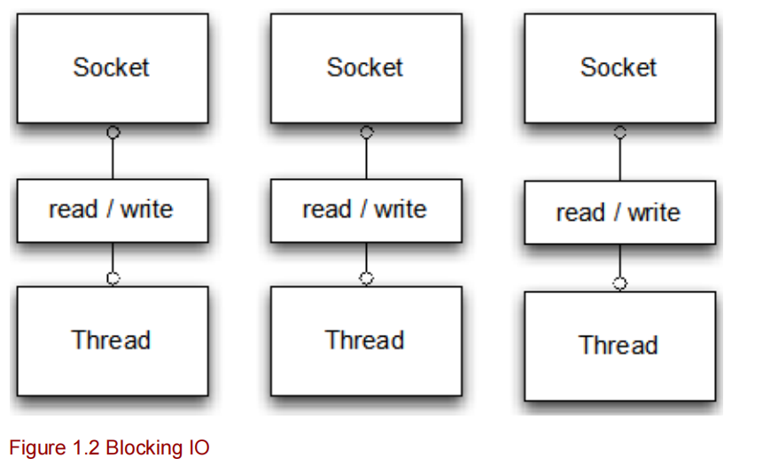
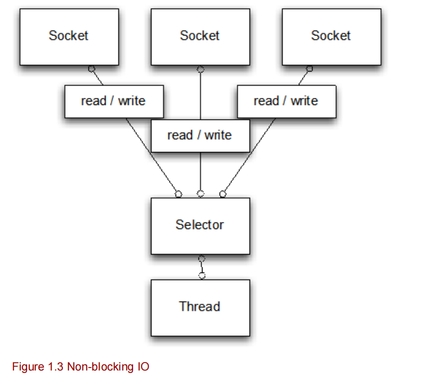
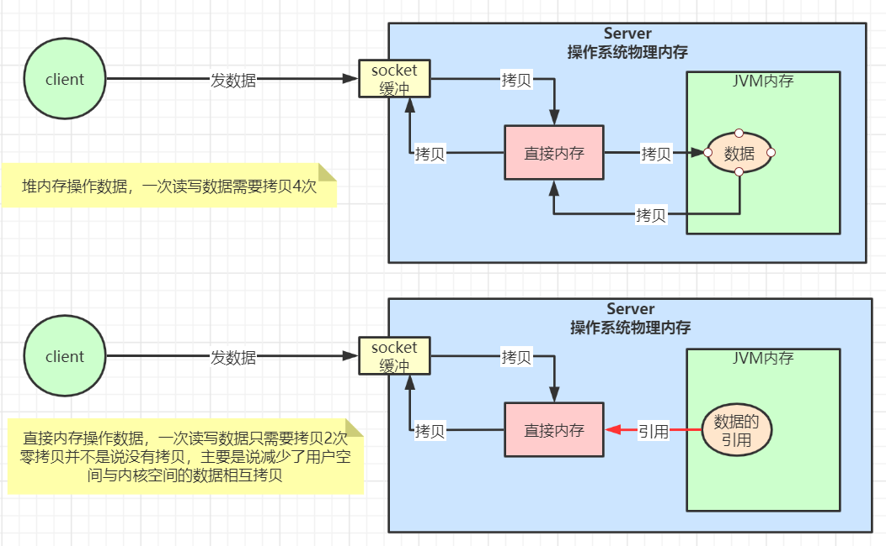

# [Netty入门](../README.md)

- [Netty入门](#Netty入门)
    - [更新日志](#更新日志)
    - [简介](#简介)
        - [1 Netty和Tomcat](#1-Netty和Tomcat)
        - [2 Netty介绍](#2-Netty介绍)
        - [3 Netty传输-零拷贝](#3-Netty传输-零拷贝)
        - [4 Netty编码](#4-Netty编码)
            - [a Netty服务端](#a-Netty服务端)
            - [b Netty客户端](#b-Netty客户端)
            - [c 对于Netty初始化调优](#c-对于Netty初始化调优)

## 更新日志

| 版本   | 更新说明                                    | 日期       | 更新人 |
| ------ | ------------------------------------------- | ---------- | ------ |
| v1.0.0 | Netty入门                  | 2021/07/06 | 张子尧 |

# 简介

​	Netty是一个利用Java的高级网络能力，隐藏其背后的复杂性二提供一个容易使用的API B/S框架。

​	Netty 是一个广泛使用的 Java 网络编程框架。它活跃和成长于用户社区，像大型公司 Facebook 和 Instagram 以及流行 开源项目如 Infinispan, HornetQ, Vert.x, Apache Cassandra 和 Elasticsearch 等，都利用其强大的对于网络抽象的核心代码。

## 1 Netty和Tomcat

​	Netty和Tomcat最大的区别就在于通信协议，Tomcat是基于Http协议的，他的实质是一个基于http协议的web容器，但是Netty不一样，他能通过编程自定义各种协议，因为netty能够通过codec自己来编码/解码字节流，完成类似redis访问的功能，这就是netty和tomcat最大的不同。Netty作为一个高性能的网络编程架构具有并发高、传输快(零拷贝)、封装好等多方面的优势，这也是他受欢迎的原因之一。

## 2 Netty介绍

​	Netty是基于NIO开发的一款网络通信架构，对比BIO对于并发性能有了很大的提高。

从图1.2和图1.3来看，bio和nio最大的区别就是处理程序的线程模型由原来的单线处理变为总控器来处理，在NIO中可以看出引入了Selector，在`Netty in action`中有这么一段描述：Keeping these figures in mind, lets dive deeper into blocking IO and non-blocking IO. Ill 
use a simple echo server to demonstrate the difference between the IO and NIO. An echo 
server accepts client requests and echos (returns) the data that it receives from the clients.

## 3 Netty传输-零拷贝

​	Netty的传输快其实是依赖了NIO 的一个特性-零拷贝。众所周知，java的内存有堆内存、栈内存、字符串创量尺等等。其中堆内存是占用内存空间最大的一块区域，也是java对象存放的区域，一般我们的数据如果从IO读取到堆内存中间要经过socket缓存区，也就是说一个数据会被拷贝两次才能到达目的地，如果数据库发的话，就会造成不必要的资源浪费。

​	Netty针对这种情况使用了NIO的零拷贝特性，当需要接受数据的时候，会在堆外开辟一片内存空间，数据会从IO直接读取到内存中去，在Netty中通过ByteBuf可以直接对数据进行直接操作，从而加快传输效率。

## 4 Netty编码

### a Netty服务端

服务端核心启动程序：

~~~java
package com.kissings.io.netty.server;

import com.kissings.io.netty.handler.NettyServerHandler;
import com.kissings.io.netty.split.MessageDecoder;
import com.kissings.io.netty.split.MessageEncoder;
import io.netty.bootstrap.ServerBootstrap;
import io.netty.channel.ChannelFuture;
import io.netty.channel.ChannelInitializer;
import io.netty.channel.ChannelOption;
import io.netty.channel.ChannelPipeline;
import io.netty.channel.nio.NioEventLoopGroup;
import io.netty.channel.socket.SocketChannel;
import io.netty.channel.socket.nio.NioServerSocketChannel;
import lombok.SneakyThrows;
import lombok.extern.slf4j.Slf4j;

/**
 * @author zhangziyao
 */
@Slf4j
public class NettyServer {

    @SneakyThrows
    public static void main(String[] args) {

        //创建两个线程组bossGroup和workerGroup, 含有的子线程NioEventLoop的个数默认为cpu核数的两倍
        // bossGroup只是处理连接请求 ,真正的和客户端业务处理，会交给workerGroup完成
        NioEventLoopGroup bossGroup = new NioEventLoopGroup(1);
        NioEventLoopGroup workerGroup = new NioEventLoopGroup();
        try {
            //创建服务器端的启动对象
            ServerBootstrap bootstrap = new ServerBootstrap();
            //使用链式编程配置参数
            bootstrap.group(bossGroup, workerGroup)//设置两个线程组
                    .channel(NioServerSocketChannel.class)//使用nio作为服务器的通道实现
                    //初始化服务器连接队列大小
                    .option(ChannelOption.SO_BACKLOG, 1024)
                    .childHandler(new ChannelInitializer<SocketChannel>() {//创建通道初始化对象
                        @Override
                        protected void initChannel(SocketChannel channel) throws Exception {
                            ChannelPipeline pipeline = channel.pipeline();
                            //对象编码
                            // pipeline.addLast(new ObjectEncoder());
                            //pipeline.addLast("encoder",new StringEncoder());
                            //解码
                            //pipeline.addLast(new ObjectDecoder(1024, ClassResolvers.cacheDisabled(null)));
                            //pipeline.addLast("decoder",new StringDecoder());
                            //对workerGroup的socketChannel设置处理器
                            //添加心跳
                            //pipeline.addLast(new IdleStateHandler(60, 60, 60, TimeUnit.SECONDS));
//                            pipeline.addLast(new HeartBeatServerHandler());
                            pipeline.addLast(new MessageDecoder());
                            pipeline.addLast(new MessageEncoder());
                            pipeline.addLast(new NettyServerHandler());
                        }
                    });

            log.info("netty server is start...");
            ChannelFuture sync = bootstrap.bind(8888).sync();//同步启动
            //异步启动
            /*sync.addListener((ChannelFutureListener) channelFuture -> {
                if (channelFuture.isSuccess()) {
                    System.out.println("SUCCESS!!!");
                } else {
                    System.out.println("FAIL!!!");
                }
            });*/
            sync.channel().closeFuture().sync();
        } finally {
            bossGroup.shutdownGracefully();
            workerGroup.shutdownGracefully();
        }
    }
}
~~~

消息处理核心方法：

~~~java
package com.kissings.io.netty.handler;

import com.kissings.io.netty.constants.NettyConstant;
import com.kissings.io.netty.enums.BeatStat;
import com.kissings.io.netty.split.MessageProtocol;
import com.kissings.io.netty.util.ProtostuffUtil;
import io.netty.buffer.ByteBuf;
import io.netty.buffer.Unpooled;
import io.netty.channel.*;
import io.netty.channel.group.ChannelGroup;
import io.netty.channel.group.DefaultChannelGroup;
import io.netty.handler.timeout.IdleStateEvent;
import io.netty.util.CharsetUtil;
import io.netty.util.concurrent.GlobalEventExecutor;
import lombok.extern.slf4j.Slf4j;

import java.nio.charset.StandardCharsets;

/**
 * 自定义handler
 *
 * @author zhangziyao
 */
@Slf4j
public class NettyServerHandler extends SimpleChannelInboundHandler<MessageProtocol> {

    int readIdleTimes = 0;
    private static final ChannelGroup channels = new DefaultChannelGroup(GlobalEventExecutor.INSTANCE);

    /**
     * 有channel就绪时触发
     *
     * @param ctx {@link ChannelHandlerContext}
     * @throws Exception 异常
     */
    @Override
    public void channelActive(ChannelHandlerContext ctx) throws Exception {
        Channel channel = ctx.channel();
        String msg = "[ 客户端 ]" + channel.remoteAddress() + " 上线了 \n";
        MessageProtocol messageProtocol = new MessageProtocol();
        messageProtocol.setLen(msg.getBytes(StandardCharsets.UTF_8).length);
        messageProtocol.setContent(msg.getBytes(StandardCharsets.UTF_8));
        channels.writeAndFlush(messageProtocol);
        channels.add(channel);
        log.info(channel.remoteAddress() + "上线了！！！");
    }

    /**
     * 读取客户端发送的数据
     *
     * @param ctx             上下文对象，含有通道{@link io.netty.channel.Channel}  管道{@link io.netty.channel.ChannelPipeline}
     * @param messageProtocol 客户端发送来的数据
     * @throws Exception 异常
     * @see io.netty.channel.Channel
     * @see io.netty.channel.ChannelPipeline
     */
    @Override
    public void channelRead0(ChannelHandlerContext ctx, MessageProtocol messageProtocol) throws Exception {
        //获取到当前 channel
        Channel channel = ctx.channel();
        int len = messageProtocol.getLen();
        String message = new String(messageProtocol.getContent(), CharsetUtil.UTF_8);
        for (Channel ch : channels) {
            if (NettyConstant.isHeartBeat) {
                if (BeatStat.ping.name().equals(message)) {
                    String msg = BeatStat.pong.name();
                    messageProtocol = new MessageProtocol(
                            msg.getBytes(StandardCharsets.UTF_8).length, msg.getBytes(StandardCharsets.UTF_8));
                    ctx.channel().writeAndFlush(messageProtocol);
                    log.info(message);
                    continue;
                }
            }
            String msg = "";
            if (channel != ch) { //不是当前的 channel,转发消息
                log.info("[ 客户端 ]" + channel.remoteAddress() + " 发送了消息：" + message + "\n");
                msg = "[ 客户端 ]" + channel.remoteAddress() + " 发送了消息：" + message + "\n";
            } else {//回显自己发送的消息给自己
                log.info("[ 自己 ]发送了消息：" + message + "\n");
                msg = "[ 自己 ]发送了消息：" + message + "\n";
            }
            messageProtocol = new MessageProtocol(
                    msg.getBytes(StandardCharsets.UTF_8).length, msg.getBytes(StandardCharsets.UTF_8));
            ch.writeAndFlush(messageProtocol);
        }
    }

    /**
     * 表示channel处于不活动状态，提示用户离线
     *
     * @param ctx 上下文对象，含有通道{@link io.netty.channel.Channel}  管道{@link io.netty.channel.ChannelPipeline}
     * @throws Exception 异常
     */
    @Override
    public void channelInactive(ChannelHandlerContext ctx) throws Exception {
        Channel channel = ctx.channel();
        String msg = "[ 客户端 ]" + channel.remoteAddress() + " 下线了" + "\n";
        MessageProtocol messageProtocol = new MessageProtocol(
                msg.getBytes(StandardCharsets.UTF_8).length, msg.getBytes(StandardCharsets.UTF_8));
        channels.writeAndFlush(messageProtocol);
        channels.remove(channel);
        log.info(channel.remoteAddress() + "下线了！！！");
    }

    /**
     * 用户事件触发该方法
     *
     * @param ctx 上下文对象，含有通道{@link io.netty.channel.Channel}  管道{@link io.netty.channel.ChannelPipeline}
     * @param evt 事件驱动
     * @throws Exception 异常
     */
    @Override
    public void userEventTriggered(ChannelHandlerContext ctx, Object evt) throws Exception {
        if (NettyConstant.isHeartBeat) {
            IdleStateEvent event = (IdleStateEvent) evt;
            switch (event.state()) {
                case READER_IDLE:
                    readIdleTimes++;
                    break;
                case WRITER_IDLE:
                case ALL_IDLE:
                    break;
                default:
                    throw new RuntimeException("没有匹配的事件驱动！！！");
            }
            log.info(ctx.channel().remoteAddress() + "超时事件：" + event.state());
            if (readIdleTimes > 3) {
                log.error("[server]读空闲超过3次，关闭连接，释放更多资源");
                String msg = BeatStat.close.name();
                MessageProtocol messageProtocol = new MessageProtocol(
                        msg.getBytes(StandardCharsets.UTF_8).length, msg.getBytes(StandardCharsets.UTF_8));
                ctx.channel().writeAndFlush(messageProtocol);
                ctx.channel().close();
            }
        }
    }
    /**
     * netty 异常捕获
     *
     * @param ctx   上下文对象，含有通道{@link io.netty.channel.Channel}  管道{@link io.netty.channel.ChannelPipeline}
     * @param cause 异常信息
     * @throws Exception 异常
     */
    @Override
    public void exceptionCaught(ChannelHandlerContext ctx, Throwable cause) throws Exception {
        cause.printStackTrace();
        ctx.close();
    }
}

~~~

### b Netty客户端

由于netty支持多种协议，一下只列出对于socket协议的处理。

java客户端

~~~java
package com.kissings.io.netty.client;

import com.kissings.io.netty.handler.NettyClientHandler;
import com.kissings.io.netty.split.MessageDecoder;
import com.kissings.io.netty.split.MessageEncoder;
import com.kissings.io.netty.split.MessageProtocol;
import com.kissings.io.netty.util.ProtostuffUtil;
import io.netty.bootstrap.Bootstrap;
import io.netty.buffer.ByteBuf;
import io.netty.channel.*;
import io.netty.channel.nio.NioEventLoopGroup;
import io.netty.channel.socket.SocketChannel;
import io.netty.channel.socket.nio.NioSocketChannel;
import lombok.Getter;
import lombok.extern.slf4j.Slf4j;

import java.nio.charset.StandardCharsets;
import java.util.Scanner;
import java.util.concurrent.TimeUnit;

/**
 * @author zhangziyao
 */
@Slf4j
@Getter
public class NettyClient {

    private final boolean isHeartBeat = false;
    private final int port;
    private final String host;
    private Bootstrap bootstrap;

    public static void main(String[] args) throws Exception {
        NettyClient nettyClient = new NettyClient("127.0.0.1", 8080);
        nettyClient.connect();

    }

    public NettyClient(String host, int port) {
        this.port = port;
        this.host = host;
        init();
    }

    public void init() {
        EventLoopGroup group = new NioEventLoopGroup();
        bootstrap = new Bootstrap();
        bootstrap.group(group)
                .channel(NioSocketChannel.class)
                .handler(new ChannelInitializer<SocketChannel>() {
                    @Override
                    protected void initChannel(SocketChannel ch) throws Exception {
                        ChannelPipeline pipeline = ch.pipeline();
                        //对象编码
                        // pipeline.addLast(new ObjectEncoder());
                        // pipeline.addLast("encoder",new StringEncoder());
                        //解码
                        //pipeline.addLast(new ObjectDecoder(1024, ClassResolvers.cacheDisabled(null)));
                        // pipeline.addLast("decoder",new StringDecoder());
                        pipeline.addLast(new MessageDecoder());
                        pipeline.addLast(new MessageEncoder());
                        pipeline.addLast(new NettyClientHandler(NettyClient.this));
                    }
                });
    }

    public void connect() throws Exception {

        log.info("netty client is start...");
        ChannelFuture channelFuture = bootstrap.connect(host, port);
        channelFuture.addListener((ChannelFutureListener) future -> {
            if (future.isSuccess()) {
                log.info("连接成功！！！");
                log.info(channelFuture.channel().remoteAddress() + "上线了！！！");
            } else {
                future.channel().eventLoop().schedule(() -> {
                    try {
                        connect();
                    } catch (Exception e) {
                        log.error("重连异常...", e);
                    }
                }, 3000, TimeUnit.MILLISECONDS);
                log.error("断线重连！！！");
            }
        });
        Scanner scanner = new Scanner(System.in);
        while (scanner.hasNextLine()) {
            String msg = scanner.nextLine();
            //通过 channel 发送到服务器端
            MessageProtocol messageProtocol = new MessageProtocol();
            messageProtocol.setContent(msg.getBytes(StandardCharsets.UTF_8));
            messageProtocol.setLen(msg.getBytes(StandardCharsets.UTF_8).length);

//            ByteBuf byteBuf = ProtostuffUtil.serializer(messageProtocol);
            channelFuture.channel().writeAndFlush(messageProtocol);
        }
        channelFuture.channel().closeFuture().sync();
    }
}
~~~

客户端消息核心处理方法

~~~java
package com.kissings.io.netty.handler;

import com.kissings.io.netty.client.NettyClient;
import com.kissings.io.netty.constants.NettyConstant;
import com.kissings.io.netty.enums.BeatStat;
import com.kissings.io.netty.split.MessageProtocol;
import com.kissings.io.netty.util.ProtostuffUtil;
import io.netty.buffer.ByteBuf;
import io.netty.buffer.Unpooled;
import io.netty.channel.ChannelHandlerContext;
import io.netty.channel.ChannelInboundHandlerAdapter;
import io.netty.channel.SimpleChannelInboundHandler;
import io.netty.handler.timeout.IdleStateEvent;
import io.netty.util.CharsetUtil;
import lombok.extern.slf4j.Slf4j;

import java.nio.charset.StandardCharsets;

/**
 * 入站通道适配器
 *
 * @author zhangziyao
 * {@link ChannelInboundHandlerAdapter} to see
 * @see io.netty.channel.ChannelInboundHandler
 * @see io.netty.channel.ChannelHandler
 * @see io.netty.channel.ChannelHandlerAdapter
 */
@Slf4j
public class NettyClientHandler extends SimpleChannelInboundHandler<MessageProtocol> {
    private final NettyClient nettyClient;

    public NettyClientHandler(NettyClient nettyClient) {
        this.nettyClient = nettyClient;
    }

    /**
     * @param ctx 上下文对象，含有通道{@link io.netty.channel.Channel}  管道{@link io.netty.channel.ChannelPipeline}
     * @throws Exception 异常
     * @see io.netty.channel.Channel
     * @see io.netty.channel.ChannelPipeline
     */
    @Override
    public void channelRead0(ChannelHandlerContext ctx, MessageProtocol messageProtocol) throws Exception {
        int len = messageProtocol.getLen();
        String msg = new String(messageProtocol.getContent(), CharsetUtil.UTF_8);
        if (msg.equals(BeatStat.pong.name())) {
            while (ctx.channel().isActive()) {
                Thread.sleep(2 * 1000);
                msg = BeatStat.ping.name();
                messageProtocol = new MessageProtocol(
                        msg.getBytes(StandardCharsets.UTF_8).length, msg.getBytes(StandardCharsets.UTF_8));
                ctx.channel().writeAndFlush(messageProtocol);
                log.info("心跳回复：{}", msg);
            }
        } else if (msg.equals(BeatStat.close.name())) {
            log.info(" 服务端关闭连接，客户端也关闭");
            ctx.channel().closeFuture();
        } else {
            log.info(msg);
        }
    }

    @Override
    public void channelInactive(ChannelHandlerContext ctx) throws Exception {
        log.error("服务器断开连接,发起重连...");
        nettyClient.connect();
    }

    @Override
    public void channelActive(ChannelHandlerContext ctx) throws Exception {
        if (NettyConstant.isHeartBeat) {
            String msg = BeatStat.ping.name();
            MessageProtocol messageProtocol = new MessageProtocol(
                    msg.getBytes(StandardCharsets.UTF_8).length, msg.getBytes(StandardCharsets.UTF_8));
            ctx.channel().writeAndFlush(messageProtocol);
        }
    }

    /**
     * netty 异常捕获
     *
     * @param ctx   上下文对象，含有通道{@link io.netty.channel.Channel}  管道{@link io.netty.channel.ChannelPipeline}
     * @param cause 异常信息
     * @throws Exception 异常
     */
    @Override
    public void exceptionCaught(ChannelHandlerContext ctx, Throwable cause) throws Exception {
        cause.printStackTrace();
        ctx.close();
    }
}
~~~

### c 对于Netty初始化调优

​	Netty对于Bootstrap设置初始化参数相关配置

~~~java
new Bootstrap().group(super.getBossGroup(), super.getWorkerGroup())
.channel(NioServerSocketChannel.class)
.handler(new LoggingHandler(LogLevel.DEBUG))
//Initialize server connection queue size
.option(ChannelOption.SO_BACKLOG, 1024)
//用于操作接收缓冲区和发送缓冲区的大小，接收缓冲区用于保存网络协议站内收到的数据，
//直到应用程序读取成功，发送缓冲区用于保存发送数据，直到发送成功。
.childOption(ChannelOption.SO_SNDBUF, 32 * 1024)
.childOption(ChannelOption.SO_RCVBUF, 32 * 1024)
/*
 * 在Netty 4中实现了一个新的ByteBuf内存池，它是一个纯Java版本的 jemalloc （Facebook也在用）。
 * 现在，Netty不会再因为用零填充缓冲区而浪费内存带宽了。不过，由于它不依赖于GC，开发人员需要小心内存泄漏。
 * 如果忘记在处理程序中释放缓冲区，那么内存使用率会无限地增长。
 * Netty默认不使用内存池，需要在创建客户端或者服务端的时候进行指定
 */
.option(ChannelOption.ALLOCATOR, PooledByteBufAllocator.DEFAULT)
.childOption(ChannelOption.ALLOCATOR, PooledByteBufAllocator.DEFAULT)
/*
 *  一般来讲我们的业务如果比较小的时候我们用同步处理，等业务到一定规模的时候，一个优化手段就是异步化。
 * 异步化是提高吞吐量的一个很好的手段。但是，与异步相比，同步有天然的负反馈机制，也就是如果后端慢了，前面也会跟着慢起来，可以自动的调节。
 * 但是异步就不同了，异步就像决堤的大坝一样，洪水是畅通无阻。如果这个时候没有进行有效的限流措施就很容易把后端冲垮。
 * 如果一下子把后端冲垮倒也不是最坏的情况，就怕把后端冲的要死不活。
 * 这个时候，后端就会变得特别缓慢，如果这个时候前面的应用使用了一些无界的资源等，就有可能把自己弄死。
 * 那么现在要介绍的这个坑就是关于Netty里的ChannelOutboundBuffer这个东西的。
 * 这个buffer是用在netty向channel write数据的时候，有个buffer缓冲，这样可以提高网络的吞吐量(每个channel有一个这样的buffer)。
 * 初始大小是32(32个元素，不是指字节)，但是如果超过32就会翻倍，一直增长。
 * 大部分时候是没有什么问题的，但是在碰到对端非常慢(对端慢指的是对端处理TCP包的速度变慢，比如对端负载特别高的时候就有可能是这个情况)的时候就有问题了，
 * 这个时候如果还是不断地写数据，这个buffer就会不断地增长，最后就有可能出问题了(我们的情况是开始吃swap，最后进程被linux killer干掉了)。
 * 为什么说这个地方是坑呢，因为大部分时候我们往一个channel写数据会判断channel是否active，但是往往忽略了这种慢的情况。
 *
 * 那这个问题怎么解决呢？其实ChannelOutboundBuffer虽然无界，但是可以给它配置一个高水位线和低水位线，
 * 当buffer的大小超过高水位线的时候对应channel的isWritable就会变成false，
 * 当buffer的大小低于低水位线的时候，isWritable就会变成true。所以应用应该判断isWritable，如果是false就不要再写数据了。
 * 高水位线和低水位线是字节数，默认高水位是64K，低水位是32K，我们可以根据我们的应用需要支持多少连接数和系统资源进行合理规划。
 */
.childOption(ChannelOption.WRITE_BUFFER_WATER_MARK,
        new WriteBufferWaterMark(32 * 1024, 64 * 1024))
// Use application layer heartbeat
.childOption(ChannelOption.SO_KEEPALIVE, true)
.childHandler(serverChannelInitializer);
~~~

