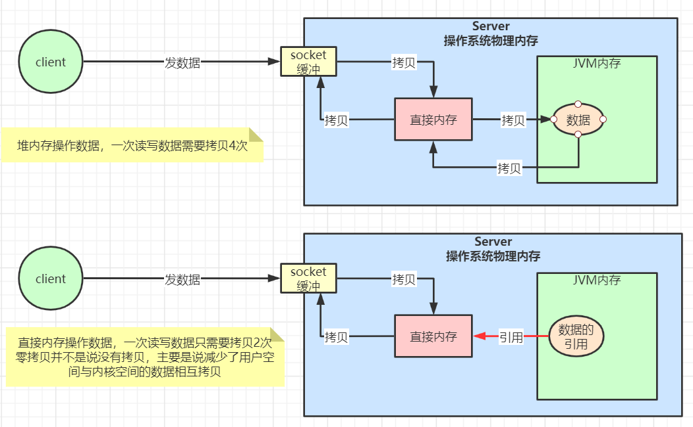

# doc

#### 介绍

精品文章、技术组件安装文档、日常笔记、学习资料等。

# 工程结构

① Doc工程清单

| 工程名                                                                     | 描述            |
|-------------------------------------------------------------------------|---------------|
|  doc                           | 父模块           |
| &nbsp;&nbsp; resources          | 收藏数据、资源文件、附件等 |
| &nbsp;&nbsp; 数据结构与算法            | 数据结构与算法学习相关文档 |
| &nbsp;&nbsp; JVM                | JVM研究相关文档     |
| &nbsp;&nbsp; 源码研究               | 源码研究相关文档      |
| &nbsp;&nbsp; 分布式组件              | 分布式组件相关使用文档   |
| &nbsp;&nbsp; Netty详解            | 分布式消息架构详解     |
| &nbsp;&nbsp; 微服务组件             | 微服务组件相关文档     |
| &nbsp;&nbsp;&nbsp;&nbsp; 注册中心   | 注册中心解决方案      |
| &nbsp;&nbsp;&nbsp;&nbsp; 分布式事务  | 分布式事务解决方案     |
| &nbsp;&nbsp;&nbsp;&nbsp; 限流容错降级 | 限流容错降级        |
| &nbsp;&nbsp; 组件安装               | 相关组件安装文档      |
| &nbsp;&nbsp; 服务器常用操作            | 服务器处理相关操作文档   |
| &nbsp;&nbsp; 工具使用               | 工具使用          |

# 目录

- [数据结构与算法](数据结构与算法)
    - [基础排序算法详解](数据结构与算法/基础排序算法详解.md)
    - [贪心算法与动态规划](数据结构与算法/贪心算法与动态规划.md)
    - [并查集算法详解](数据结构与算法/并查集算法详解.md)
    - [限流算法详解](数据结构与算法/限流算法详解.md)
    - [数论](数据结构与算法/数论.md)
    - [树](数据结构与算法/树.md)
    - [图论](数据结构与算法/图论.md)
- [JVM](JVM)
    - [JVM内存模型](JVM/JVM内存模型.md)
- [源码研究](源码研究)
    - [Spring Ioc设计与实现原理](源码研究/SpringIoc设计与实现原理.md)
- [MYSQL详解](MYSQL详解)
    - [MySQL事务隔离级别](MYSQL详解/MySQL事务隔离级别.md)
    - [深入理解MVCC](MYSQL详解/深入理解MVCC.md)
- [分布式组件](分布式组件)
    - [Redis常用的数据结构说明](分布式组件/缓存数据库/Redis常用的数据结构说明.md)
    - [分布式消息组件-Rabbitmq](分布式组件/分布式消息组件-Rabbitmq.md)
- [Netty详解](Netty详解)
    - [BIO、NIO、AIO详解](Netty详解/BIO、NIO、AIO详解.md)
    - [Netty入门](Netty详解/Netty入门.md)
    - [深入理解Netty架构](Netty详解/深入理解Netty架构.md)
- [微服务组件](微服务组件)
    - [注册中心](微服务组件/注册中心)
        - [Nacos基本使用](微服务组件/注册中心/Nacos基本使用.md)
    - [分布式事务](微服务组件/分布式事务)
        - [分布式事务解决方案](微服务组件/分布式事务/分布式事务解决方案.md)
    - [限流容错降级](微服务组件/限流容错降级)
        - [微服务限流容错降级Sentinel入门](微服务组件/限流容错降级/微服务限流容错降级Sentinel入门.md)
        - [降级规则详解](微服务组件/限流容错降级/降级规则详解.md)
        - [流量控制](微服务组件/限流容错降级/流量控制.md)
        - [热点规则详解](微服务组件/限流容错降级/热点规则详解.md)
        - [系统规则详解](微服务组件/限流容错降级/热点规则详解.md)
- [面试题汇总](面试题汇总/面试题总结.md)
- [组件安装](组件安装)
    - [ELK搭建文档](组件安装/ELK搭建文档.md)
    - [Kafka安装文档](组件安装/Kafka安装文档.md)
    - [Mysql安装文档](组件安装/Mysql安装文档.md)
    - [RabbitMq搭建文档](组件安装/RabbitMq搭建文档.md)
    - [Zookeeper环境搭建](组件安装/Zookeeper环境搭建.md)
- [服务器相关](服务器相关)
    - [KVM启动异常解决方案](服务器相关/KVM启动异常解决方案.md)
    - [防火墙与selinux](服务器相关/防火墙与selinux.md)
    - [Linux添加路由](服务器相关/Linux添加路由.md)
- [工具使用](工具使用)
    - [Git操作命令](工具使用/Git操作命令.md)
    - [Gradle中build文件详解](工具使用/Gradle/Gradle中build文件详解.md)
- [Serverless](Serverless)
    - [[Server是什么？](Serverless/Server是什么.md)
- [踩坑](踩坑)
    - [springboot3.x中spring.factories失效无法注册的原因及解决方法.md](踩坑/springboot3.x中spring.factories失效无法注册的原因及解决方法.md)

# 深入理解Netty架构

## 简介

 在IO程序开发中，NIO的类库和API繁杂，使用麻烦：要熟练掌握selector、serverSocketChannel、socketChannel、ByteBuffer等类库的使用已经繁琐的异常处理等。

 开发工作量和难度都非常大：例如客户端面临断线重连、网络闪断、心跳处理、半包读写、网络拥塞和异常流的处理等。

 netty是对NIO的api进行了良好的封装，解决了上述的问题。并且netty拥有高性能，高吞吐量、低延迟、低消耗、最小化不必要的内存复制等优点。

## Netty线程模型

<br/>


**模型解释**

+ netty抽象出两组线程池bossGroup和workerGroup，bossGroup专门负责接收客户端的连接请求，workerGroup负责网络的读写操作。两组线程池都用的是NioEventLoopGroup；
+ NioEventLoopGroup相当于一个事件循环线程组，这个组总含有铎哥事件循环线程，每一个线程都是一个NioEvenLoop；
+ NioEvenLoop都有一个selector，用于监听注册在其中的socketChannel的网络通信；
+ 每个boss NioEvenLoop线程内部循环执行有三个步骤
  + 处理acceot事件，与client建立连接，生成SocketChannel；
  + 将socketChannel注册到一个workerGroup中NioEventLoop上的selector；
  + 处理任务队列中的任务，即runAllTasks。

- 每个worker NioEvenLoop线程内部循环执行有三个步骤
  - 轮询注册到自己selector上的所有NioSocketChannel 的read, write事件；
  - 处理 I/O 事件， 即read , write 事件， 在对应NioSocketChannel 处理业务；
  - 处理任务队列中的任务，即runAllTasks。

- 每个worker NIOEventLoop处理NioSocketChannel业务时，会使用 pipeline (管道)，管道中维护了很多 handler 处理器用来处理 channel 中的数据。

## Netty组件

- **Bootstrap、ServerBootstrap：**
  Bootstrap是一个netty应用的引导类，主要作用是配置整个netty程序，串联各个组件，其中Bootstrap是netty客户端的引导类，ServerBootstrap是netty服务端的引导类。
- **Future、ChannelFuture：**
  在netty中所有的IO操作都是异步的，不能实时感知消息是否被正确处理。但是可以通过注册监听器来监听连接状态，具体实现就是通过Future、ChannelFuture，当执行成功或失败时时监听就会自动触发注册的监听事件。
- **channel：**Netty 网络通信的组件，能够用于执行网络 I/O 操作。Channel 为用户提供：
  - 当前网络连接的通道的状态(例如是否打开？是否已连接？)
  - 网络连接的配置参数 (例如接收缓冲区大小)
  - 提供异步的网络 I/O 操作(如建立连接，读写，绑定端口)，异步调用意味着任何 I/O 调用都将立即返回，并且不保证在调用结束时所请求的 I/O 操作已完成。
  - 调用立即返回一个 ChannelFuture 实例，通过注册监听器到 ChannelFuture 上，可以 I/O 操作成功、失败或取消时回调通知调用方。
  - 支持关联 I/O 操作与对应的处理程序。

不同协议、不同的阻塞类型的连接都有不同的 Channel 类型与之对应。

```JAVA
NioSocketChannel//异步的客户端 TCP Socket 连接。
        NioServerSocketChannel//异步的服务器端 TCP Socket 连接。
        NioDatagramChannel//异步的 UDP 连接。
        NioSctpChannel//异步的客户端 Sctp 连接。
        NioSctpServerChannel//异步的 Sctp 服务器端连接。
//这些通道涵盖了 UDP 和 TCP 网络 IO 以及文件 IO。
```

- **Selector：**
  netty基于selector对象时间IO多路复用，通过selector一个线程可以监听多个连接的channel事件。当向一个selector中注册channel后，selector内部的机制就可以自动不断第查询(select方法)
  这些注册的channel是否有已就绪的IO事件(例如可读、可写、网络连接完成等)。
- **NioEventLoop：**NioEventLoop 中维护了一个线程和任务队列，支持异步提交执行任务，线程启动时会调用 NioEventLoop 的 run 方法，执行 I/O 任务和非 I/O 任务：
  - I/O 任务，即 selectionKey 中 ready 的事件，如 accept、connect、read、write 等，由 processSelectedKeys 方法触发。
  - 非 IO 任务，添加到 taskQueue 中的任务，如 register0、bind0 等任务，由 runAllTasks 方法触发。
- **NioEventLoopGroup：**NioEventLoopGroup，主要管理 eventLoop 的生命周期，可以理解为一个线程池，内部维护了一组线程，每个线程(NioEventLoop)负责处理多个 Channel
  上的事件，而一个 Channel 只对应于一个线程。
- **ChannelHandler：**ChannelHandler 是一个接口，处理 I/O 事件或拦截 I/O 操作，并将其转发到其 ChannelPipeline(业务处理链)中的下一个处理程序。

```java
//ChannelHandler 本身并没有提供很多方法，因为这个接口有许多的方法需要实现，方便使用期间，可以继承它的子类：
ChannelInboundHandler //用于处理入站 I/O 事件。
        ChannelOutboundHandler //用于处理出站 I/O 操作。
//或者使用以下适配器类：
        ChannelInboundHandlerAdapter //用于处理入站 I/O 事件。
        ChannelOutboundHandlerAdapter //用于处理出站 I/O 操作。
```

- **ChannelHandlerContext：**保存 Channel 相关的所有上下文信息，同时关联一个 ChannelHandler 对象。
- **ChannelPipline：**保存 ChannelHandler 的 List，用于处理或拦截 Channel 的入站事件和出站操作。ChannelPipeline
  实现了一种高级形式的拦截过滤器模式，使用户可以完全控制事件的处理方式，以及 Channel 中各个的ChannelHandler 如何相互交互。

在 Netty 中每个 Channel 都有且仅有一个 ChannelPipeline 与之对应，它们的组成关系如下：


## ByteBuf详解

从结构上来说，ByteBuf由一串字节数组构成，数组中每个字节用来存放信息。

byteBuf提供了两个索引，一个是用俩读取数据，一个是用俩写入数据的，这两个索引通过在字节数组中移动，来定位需要读或者写信息的位置。当从 ByteBuf 读取时，它的 readerIndex（读索引）将会根据读取的字节数递增。同样，当写
ByteBuf 时，它的 writerIndex 也会根据写入的字节数进行递增。readerIndex的极限刚好是writerIdenx


## Netty编解码

**编码解码器**

当netty发送或者接受一个消息的时候，就会发生一次数据转换。入站消息会被解码，从字节转换为对象等，出站消息则会被编码成字节。

netty提供了一系列使用的编解码器，都是通过channelInboundHandler或者channelOutboundHandler接口来实现。在这些类中，channelRead方法会被重写。以入站消息为例，对于每个从入站channel读取的消息，channelRead方法会被调用，随机会调用由编码器所提供的的decode()
，方法对消息进行解码。并将已经解码的字节转发给channelPipeline中的下一个channelInboundHandler。

netty提供的编解码器：

字符串：StringEncoder和StringDecoder

对象：ObjectEncoder和ObjectDecoder

众所周知，jdk提供的编解码器性能上来说不会太高。如果要实现高效的编解码可以使用protobuf，但是protobuf需要维护大量的proto文件 比较麻烦，所以一般情况下可以选择使用protostuff。

protostuff是一个机遇protobuf实现的序列化方法，它较于protobuf最明显的好处是在几乎不损耗性能的情况下做到了不用写proto文件来实现序列化。

实现如下：

```java
<dependency>
<groupId>com.dyuproject.protostuff</groupId>
<artifactId>protostuff-api</artifactId>
<version>1.0.10</version>
</dependency>
<dependency>
<groupId>com.dyuproject.protostuff</groupId>
<artifactId>protostuff-core</artifactId>
<version>1.0.10</version>
</dependency>
<dependency>
<groupId>com.dyuproject.protostuff</groupId>
<artifactId>protostuff-runtime</artifactId>
<version>1.0.10</version>
</dependency>
```

**ProtostuffUtil**

```java
import com.dyuproject.protostuff.LinkedBuffer;
import com.dyuproject.protostuff.ProtostuffIOUtil;
import com.dyuproject.protostuff.Schema;
import com.dyuproject.protostuff.runtime.RuntimeSchema;
import io.netty.buffer.ByteBuf;
import io.netty.buffer.Unpooled;

import java.util.Map;
import java.util.concurrent.ConcurrentHashMap;

/**
 * 自定义编解码器
 *
 * @author zhangziyao
 * @date 2021/2/3 12:25 下午
 */
public class ProtostuffUtil {

    private static final Map<Class<?>, Schema<?>> cachedSchema = new ConcurrentHashMap<Class<?>, Schema<?>>();

    private static <T> Schema<T> getSchema(Class<T> clazz) {
        @SuppressWarnings("unchecked")
        Schema<T> schema = (Schema<T>) cachedSchema.get(clazz);
        if (schema == null) {
            schema = RuntimeSchema.getSchema(clazz);
            if (schema != null) {
                cachedSchema.put(clazz, schema);
            }
        }
        return schema;
    }


    /**
     * 序列化
     *
     * @param obj 序列化对象
     * @return 返回 {@link ByteBuf}
     */
    public static <T> ByteBuf serializer(T obj) {
        @SuppressWarnings("unchecked")
        Class<T> clazz = (Class<T>) obj.getClass();
        LinkedBuffer buffer = LinkedBuffer.allocate(LinkedBuffer.DEFAULT_BUFFER_SIZE);
        try {
            Schema<T> schema = getSchema(clazz);
            return Unpooled.copiedBuffer(ProtostuffIOUtil.toByteArray(obj, schema, buffer));
        } catch (Exception e) {
            throw new IllegalStateException(e.getMessage(), e);
        } finally {
            buffer.clear();
        }
    }

    /**
     * 反序列化
     *
     * @param bytes {@link byte[]}
     * @param clazz 对象class
     * @return 返回反序列化对象
     */
    public static <T> T deserializer(byte[] bytes, Class<T> clazz) {
        try {
            T obj = clazz.newInstance();
            Schema<T> schema = getSchema(clazz);
            ProtostuffIOUtil.mergeFrom(bytes, obj, schema);
            return obj;
        } catch (Exception e) {
            throw new IllegalStateException(e.getMessage(), e);
        }
    }

    /**
     * byteBuf case byte[]
     *
     * @param byteBuf {@link ByteBuf}
     * @return byte[]
     */
    public static byte[] byteBufToBytes(ByteBuf byteBuf) {
        byte[] bytes = new byte[byteBuf.readableBytes()];
        byteBuf.readBytes(bytes);
        return bytes;
    }
}
```

## Netty粘包拆包

TCP是一个流协议，
是一个没有界限的一串二进制数据，TCP作为传输存协议并不了解上层业务数据的具体含义，他会根据TCP缓冲区的实际情况进行数据包的划分，所以在业务上认为是一个完整的包，可能会被TCP拆分为多个包进行发送，也有可能把多个小的包封装成一个大的数据包发送。这样就会产生TCP粘包拆包的问题。面向流的通信是无消息保护边界的。


**解决方案**

+ 消息定长度，传输的数据固定长度，例如每次发送一百个字节，不够用空位填充。
+ 在数据包的尾部添加特殊字符，比如中划线、下划线等。
+ 发送消息的同时发送消息长度，读取消息的时候按照固定的长度读取消息。

netty提供了多个解码器，可以用来进行分包操作

+ LineBasedFrameDecoder （回车换行分包）
+ DelimiterBasedFrameDecoder（特殊分隔符分包）
+ FixedLengthFrameDecoder（固定长度报文来分包）

## Netty心跳检测

所谓心跳, 即在 TCP 长连接中, 客户端和服务器之间定期发送的一种特殊的数据包, 通知对方自己还在线, 以确保 TCP 连接的有效性.

在 Netty 中, 实现心跳机制的关键是 IdleStateHandler

```java
public IdleStateHandler(int readerIdleTimeSeconds,int writerIdleTimeSeconds,int allIdleTimeSeconds){
        this((long)readerIdleTimeSeconds,(long)writerIdleTimeSeconds,(long)allIdleTimeSeconds,TimeUnit.SECONDS);
        }
```

- readerIdleTimeSeconds: 读超时. 即当在指定的时间间隔内没有从 Channel 读取到数据时, 会触发一个 READER_IDLE 的 IdleStateEvent 事件.
- writerIdleTimeSeconds: 写超时. 即当在指定的时间间隔内没有数据写入到 Channel 时, 会触发一个 WRITER_IDLE 的 IdleStateEvent 事件.
- allIdleTimeSeconds: 读/写超时. 即当在指定的时间间隔内没有读或写操作时, 会触发一个 ALL_IDLE 的 IdleStateEvent 事件.

添加心跳handler并定制心跳

```java
pipeline.addLast(new IdleStateHandler(5,0,0,TimeUnit.SECONDS));
        pipeline.addLast(new HeartBeatServerHandler());
```

HeartBeatServerHandler

```java
import com.kissings.io.netty.split.MessageProtocol;
import com.kissings.io.netty.util.ProtostuffUtil;
import io.netty.buffer.ByteBuf;
import io.netty.channel.ChannelHandlerContext;
import io.netty.channel.ChannelInboundHandlerAdapter;
import io.netty.handler.timeout.IdleStateEvent;
import lombok.extern.slf4j.Slf4j;

/**
 * @author zhangziyao
 * @date 2021/2/4
 */
@Slf4j
public class HeartBeatServerHandler extends ChannelInboundHandlerAdapter {

    int readIdleTimes = 0;

    @Override
    public void channelRead(ChannelHandlerContext ctx, Object msg1) throws Exception {
        ByteBuf byteBuf = (ByteBuf) msg1;
        MessageProtocol messageProtocol = ProtostuffUtil.deserializer(ProtostuffUtil.byteBufToBytes(byteBuf), MessageProtocol.class);
        String msg = messageProtocol.getContent().toString();
        log.info(msg);
        if ("ping".equals(msg)) {
            ctx.channel().writeAndFlush(ProtostuffUtil.serializer("ok"));
        } else {
            ctx.channel().writeAndFlush(ProtostuffUtil.serializer(msg));
        }

    }

    /**
     * 用户事件触发该方法
     *
     * @param ctx 上下文对象，含有通道{@link io.netty.channel.Channel}  管道{@link io.netty.channel.ChannelPipeline}
     * @param evt 事件驱动
     * @throws Exception 异常
     */
    @Override
    public void userEventTriggered(ChannelHandlerContext ctx, Object evt) throws Exception {
        IdleStateEvent event = (IdleStateEvent) evt;
        switch (event.state()) {
            case READER_IDLE:
                readIdleTimes++;
                break;
            case WRITER_IDLE:
            case ALL_IDLE:
                break;
            default:
                throw new RuntimeException("没有匹配的事件驱动>>>>>>>");
        }
        log.info(ctx.channel().remoteAddress() + "超时事件：" + event.state());
        if (readIdleTimes > 3) {
            log.info("[server]读空闲超过3次，关闭连接>>>>>>>>>>");
            ctx.channel().writeAndFlush(ProtostuffUtil.serializer("idle close"));
            ctx.channel().close();
        }
    }

    @Override
    public void channelActive(ChannelHandlerContext ctx) throws Exception {
        log.info("=== " + ctx.channel().remoteAddress() + " is active ===");
    }
```

## 直接内存

直接内存并不是虚拟机运行时数据区的一部分，也不是java虚拟机规范中定义的内存区域，而是一种堆外内存，也就是说直接从机器的物理内存上划分一块区域，java用directByteBuffer可以分配一块直接内存。比如元空间对应的内存就是直接内存。
<br/>


直接内存的优缺点

优点：

+ 不占用对内存的使用，减少full gc
+ ava虚拟机实现上，本地IO会直接操作直接内存（直接内存=>系统调用=>硬盘/网卡），而非直接内存则需要二次拷贝（堆内存=>直接内存=>系统调用=>硬盘/网卡）

缺点：

+ 初始分配较慢。
+ 没有jvm直接帮助管理内存，容易发生内存溢出。为了避免一直没有FULL
  GC，最终导致直接内存把物理内存耗完。我们可以指定直接内存的最大值，通过-XX：MaxDirectMemorySize来指定，当达到阈值的时候，调用system.gc来进行一次FULL GC，间接把那些没有被使用的直接内存回收掉。

## Netty零拷贝



**Netty高并发高性能架构设计精髓**

- 主从Reactor线程模型
- NIO多路复用非阻塞
- **无锁串行化**设计思想
- 支持高性能序列化协议
- 零拷贝(直接内存的使用)
- ByteBuf内存池设计
- 灵活的TCP参数配置能力
- 并发优化

## 无锁串行化设计思想

在大多数场景下，并行多线程处理可以提升系统的并发性能。但是，如果对于共享资源的并发访问处理不当，会带来严重的锁竞争，这最终会导致性能的下降。为了尽可能的避免锁竞争带来的性能损耗，可以通过串行化设计，即消息的处理尽可能在同一个线程内完成，期间不进行线程切换，这样就避免了多线程竞争和同步锁。NIO的多路复用就是一种无锁串行化的设计思想(
理解下Redis和Netty的线程模型)

为了尽可能提升性能，Netty采用了串行无锁化设计，在IO线程内部进行串行操作，避免多线程竞争导致的性能下降。表面上看，串行化设计似乎CPU利用率不高，并发程度不够。但是，通过调整NIO线程池的线程参数，可以同时启动多个串行化的线程并行运行，这种局部无锁化的串行线程设计相比一个队列-多个工作线程模型性能更优。

Netty的NioEventLoop读取到消息之后，直接调用ChannelPipeline的fireChannelRead(Object msg)
，只要用户不主动切换线程，一直会由NioEventLoop调用到用户的Handler，期间不进行线程切换，这种串行化处理方式避免了多线程操作导致的锁的竞争，从性能角度看是最优的。

