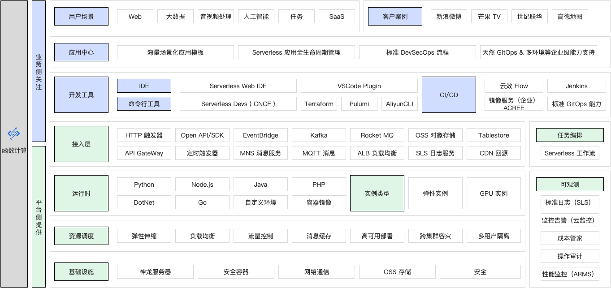
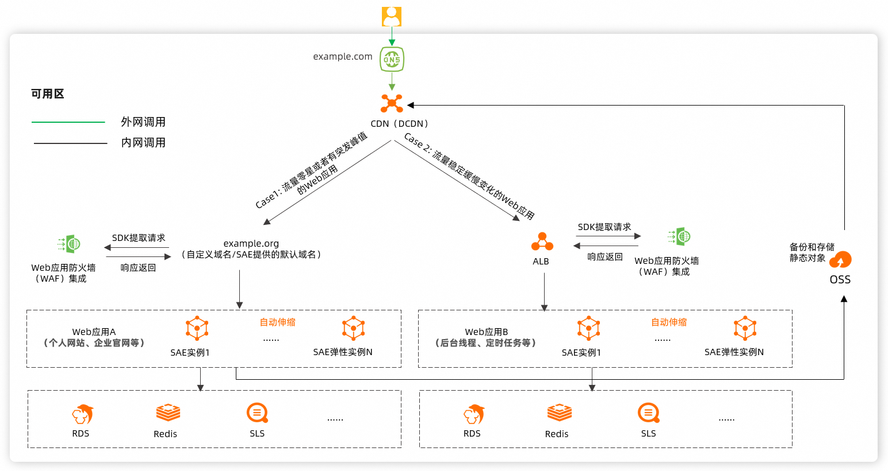
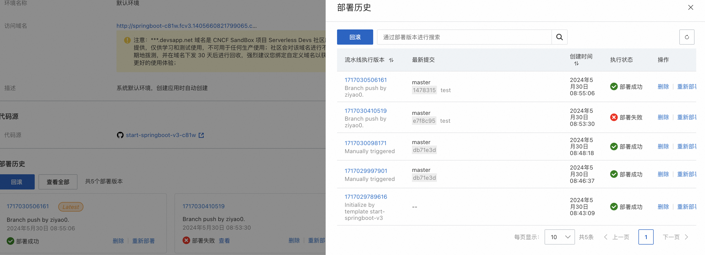
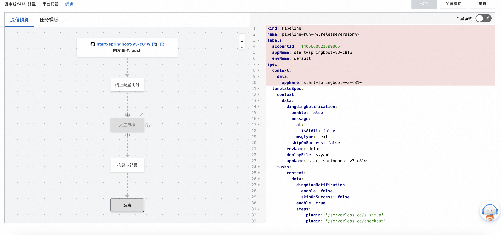

# Serverless是什么？

[TOC]

## 前言

在数字化转型浪潮中，企业和开发者追求更高效、更灵活的开发和部署。传统服务器管理虽成熟，但存在高昂运维成本、资源浪费和扩展困难等问题。尤其在互联网时代，应用需应对突发流量和快速迭代，传统架构难以满足需求。为此，云计算技术兴起，Serverless架构以其按需计费、自动伸缩和简化运维的优势，迅速受到青睐。

作为一名开发者，最近体验了阿里云提供的Serverless产品——函数计算FC 3.0。函数计算3.0版是产品的一个重大升级版本，在函数管理、函数执行引擎、自定义域名、函数授权及弹性伸缩规则方面进行了多项改进，旨在为用户提供极简的产品体验。

以下将从Serverless的优势、敏捷部署及其带来的好处等方面介绍我的使用体验。

## 一 阿里云函数计算FC 3.0

### 产品架构

函数计算主要包含函数、实例、运行环境、触发器、层、应用中心等功能组件。

### 1.为什么选择Serverless

##### 1. 降低运维成本

使用serverless架构，开发者无需关心底层服务器的管理和运维。这意味着不再需要为服务器的维护、升级、扩展等事务操心，从而专注于业务逻辑的开发，大幅降低了运维成本和复杂性。

##### 2. 按需计费

函数计算FC3.0采用按需计费模式，只为实际使用的资源付费。这种模式尤其适用于不定时且负载波动较大的应用，能够有效避免传统服务器常驻带来的高额费用。

##### 3. 高可扩展性

serverless架构天然具有高可扩展性。无论是高峰期的突发流量，还是低峰期的闲置资源，函数计算FC3.0都能自动伸缩，确保应用始终在最佳状态下运行。

### 2.应用托管

##### 1. 敏捷部署

在Spring Boot项目中，结合GitHub代码仓库管理，我的开发流程变得更加顺畅和高效。通过简单的配置，代码的每次提交和更新都可以触发自动部署，无需手动干预，极大地提升了开发效率。

##### 2. 快速迭代

由于serverless架构不需要考虑底层基础设施的管理，代码的迭代速度得到了显著提升。我能够快速部署新功能或修复bug，确保应用始终保持最新版本。

##### 3. 便捷的本地开发与调试

阿里云函数计算FC3.0提供了便捷的本地开发工具，开发者可以在本地环境中进行代码编写和调试，确保功能无误后再部署到线上环境。这种方式不仅提高了开发效率，也降低了线上环境出现问题的风险。

### 3.使用Serverless带来的好处

##### 1. 专注业务逻辑

serverless架构的最大优势之一是让开发者能够专注于业务逻辑的开发，而无需分散精力在服务器管理上。这不仅提高了开发效率，也让开发者能够更加专注于提升用户体验和产品质量。

##### 2. 提升团队协作效率

结合GitHub代码仓库管理，团队成员可以方便地协同开发。每次代码提交都可以自动触发部署，确保团队成员始终在同一版本上进行开发和测试，大幅提升了团队协作效率。

##### 3. 提高资源利用率

按需计费模式确保了资源的高效利用。无论是突发流量还是日常运营，函数计算FC3.0都能够智能调整资源分配，避免了传统服务器的资源浪费问题。

## 二 Serverless

Serverless，顾名思义，是一种“无服务器”架构。然而，"无服务器"并不意味着没有服务器，而是开发者无需管理服务器。Serverless架构的兴起主要是为了解决传统架构中存在的几个关键问题：

1. **资源浪费**：在传统架构中，服务器通常需要常驻运行，导致资源浪费。
2. **维护复杂**：需要手动管理服务器，包括硬件维护、操作系统更新、安全补丁等。
3. **扩展困难**：应对流量高峰时，传统架构需要手动扩展服务器，费时费力且容易出错。

Serverless的出现旨在简化这些过程，让开发者专注于代码和业务逻辑，而不是基础设施的管理。

**背景**

随着云计算的普及和发展，越来越多的企业和开发者开始使用云服务进行应用开发和部署。在此背景下，Serverless作为一种新兴架构应运而生。Serverless架构通过自动化的资源管理和按需计费模式，为开发者提供了更高效、更灵活的开发体验。

### 1.什么是Serverless？

Serverless是一种云计算执行模型，其中云提供商动态管理机器资源的分配。Serverless架构包括两种主要形式：

1. **Backend as a Service (BaaS)**：提供第三方服务来管理应用的后端功能，如数据库、身份验证、存储等。
2. **Function as a Service (FaaS)**：允许开发者编写代码片段（函数），这些函数可以在事件触发时自动执行，如HTTP请求、数据库变更等。

在Serverless架构中，开发者不需要担心服务器的部署、扩展和管理，只需关注代码的编写和功能的实现。Serverless架构具有以下特点：

1. **自动伸缩**：根据负载自动调整资源，确保高可用性和性能。
2. **按需计费**：只为实际使用的资源付费，避免了资源浪费。
3. **简化运维**：无需管理服务器，降低了运维的复杂性和成本。

### 2.函数计算FC3.0

阿里云函数计算（Function Compute）是阿里云推出的一种Serverless计算服务。作为FC的最新版本，FC3.0在性能、稳定性和用户体验上进行了全面升级。阿里云函数计算FC3.0的设计背景和目标包括：

1. **提高开发效率**：通过提供一站式的Serverless开发、部署和管理工具，简化了开发者的工作流程。
2. **提升性能和稳定性**：在底层架构上进行优化，提供更快的启动速度和更高的稳定性，满足企业级应用的需求。
3. **增强灵活性**：支持多种编程语言和运行时环境，满足不同开发者的需求。

阿里云函数计算FC3.0的推出，是为了解决传统服务器管理中的痛点，让开发者能够更加专注于业务逻辑的实现，提升开发效率和用户体验。

### 结语

Serverless架构的出现和发展，为现代软件开发带来了巨大的变革。从解决传统架构中的资源浪费和维护复杂问题，到实现按需计费和自动伸缩，Serverless让开发者能够更加专注于业务逻辑的开发。而阿里云函数计算FC3.0的推出，进一步提升了Serverless的性能和用户体验，成为开发者在云端开发的强大工具。通过这种架构，我们能够更加高效、灵活地应对各种开发和部署需求，推动应用的快速迭代和创新。