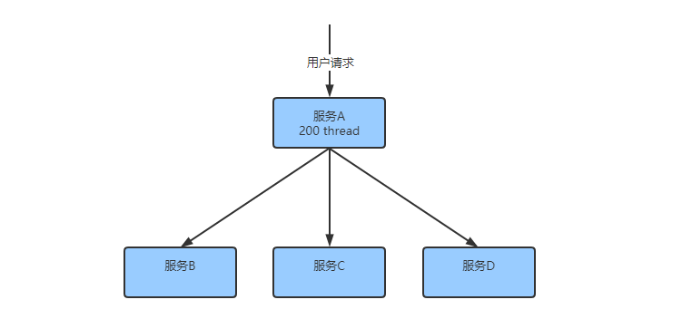
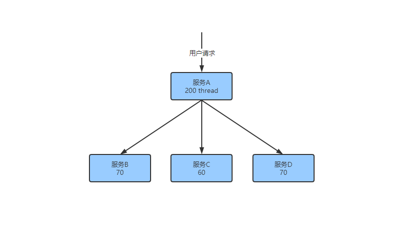
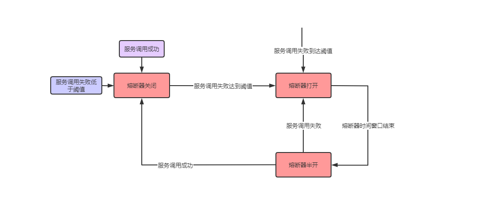
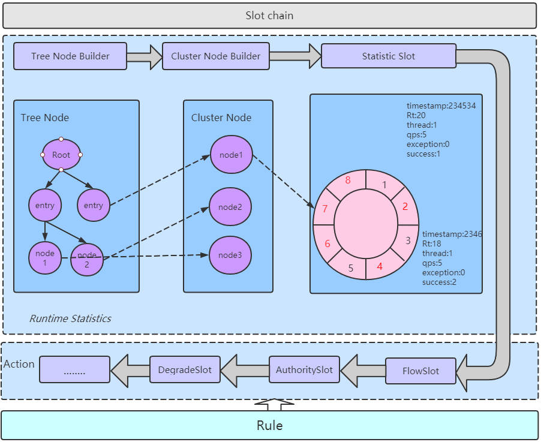
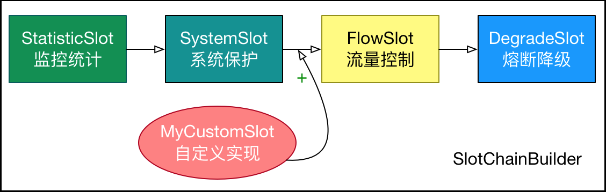
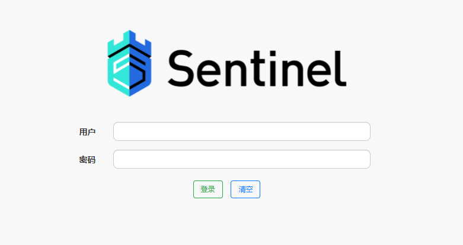
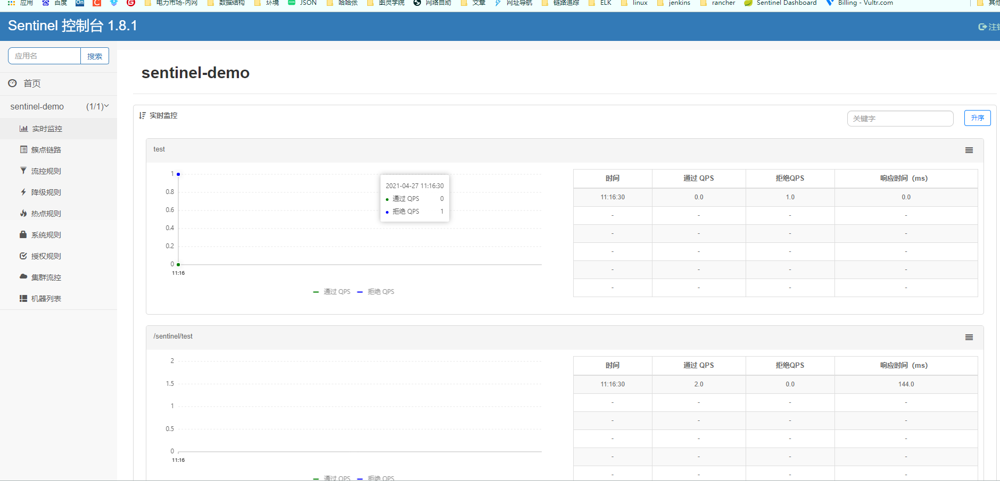
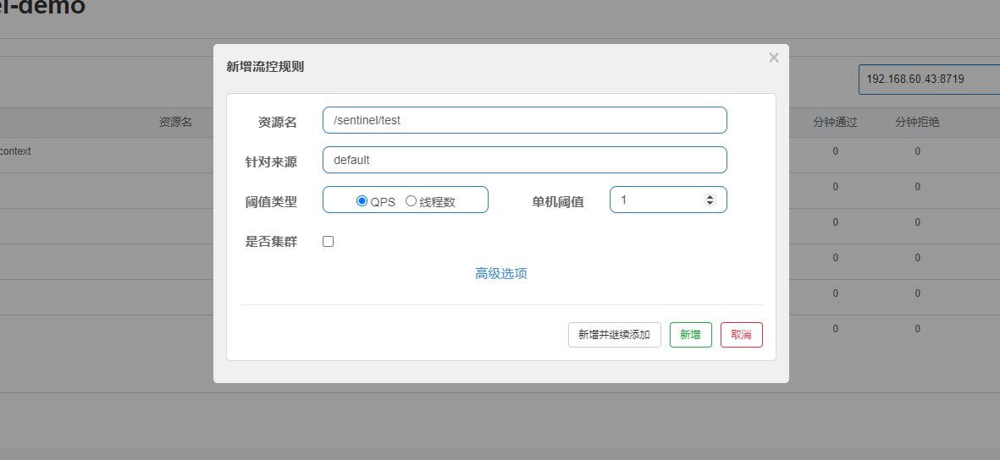
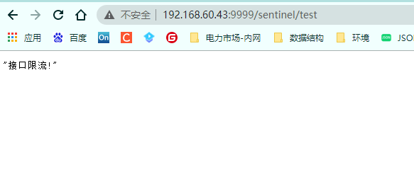

# [微服务限流容错降级sentinel入门](../../README.md)

- [微服务限流容错降级sentinel入门](#[微服务限流容错降级sentinel入门](../../README.md))
- [更新日志](#更新日志)
- [前言](#前言)
    - [1 分布式系统存在的问题](#1-分布式系统存在的问题)
    - [2 解决方案](#2-解决方案)
        - [2.1 超时机制](#21-超时机制)
        - [2.2 服务限流（资源隔离）](#22-服务限流(资源隔离))
        - [2.3 服务熔断](#23-服务熔断)
        - [2.4 服务降级](#24-服务降级)
- [一 简介](#一-简介)
    - [1 Sentinel基本概念](#1-Sentinel基本概念)
        - [1.1 特征](#11-特征)
        - [1.2 sentinel和hystrix对比](#12-sentinel和hystrix对比)
    - [2 Sentinel工作原理](#2-Sentinel工作原理)
        - [2.1 基本概念](#21-基本概念)
        - [2.2 Sentinel工作流程](#22-Sentinel工作流程)
    - [3 Sentinel Quit Start](#3-SentinelQuitStart)
        - [3.1 API实现](#31-API实现)
        - [3.2 注解实现](#32-注解实现)

# 更新日志

| 文档版本   | 更新说明           | 更新时间      | 更新人 |
|--------|----------------|-----------|-----|
| v1.0.0 | 编写sentinel使用文档 | 2021/4/20 | 张子尧 |
| v1.0.1 | 完善sentinel入门文档 | 2021/4/6  | 张子尧 |

# 前言

+ 1 服务的并发量达到一定程度，流量超过上限时，如何处理？
+ 2 微服务调用，响应时间过长，影响整个链路上所有服务时如何处理？
+ 3 **`Alibaba Sentinel`**如何处理服务容错，降级？

## 1 分布式系统存在的问题

​ 在多服务的系统中，实现一个比较复杂的业务逻辑可能会依赖很多歌微服务，比如说服务A会依赖服务B/C/D等等。



​ 当用户调用依赖服务的时候会共享线程池。如果依赖的其中一个服务不可用就会出现线程池里的所有线程都会等待响应而被阻塞，从而造成服务雪崩。

## 2 解决方案

### 2.1 超时机制

​ 在不做任何处理的情况下。服务提供者会不可用会导致消费者请求线程强制等待，从而使得线程资源耗尽。

超时机制是规定超时时间，一旦发生超时，马上释放资源。一定程度上能够解决资源耗尽的问题。

### 2.2 服务限流(资源隔离)



​
限制请求核心服务的流量，是大部分流量拦截在核心服务外，这样能够更好的保证核心服务的异常问题。对于一下游服务可以先限制访问量，分配固定资源，这样能保证整体的的资源不会被耗尽。服务之间的限流和资源是怎么实现的？通过`线程池+队列方式`
或者通过`信号量`的方式。

### 2.3 服务熔断

​ 当远程服务不稳当或者由于网络抖动产生服务不可用，暂时性的关闭服务，就叫做服务熔断。

​
通过对资源的实施监控，当一定时间内失败率达到阈值时，对服务进行熔断，当请求到达的时候直接返回，而不去调用原本的调用逻辑。在熔断一段时间后，熔断器会进入半开状态，此时允许一次请求调用，如果成功，熔断器关闭，应用正常调用；如果不成功继续回到打开状态，以此循环。


### 2.4 服务降级

​ 服务降级是服务熔断的产物。就是当服务熔断后，服务将不会被调用，接口会直接调用配置好的fallback回调，列如：备用接口、缓存或mock数据。

# 一 简介


<br>

​    **`Alibaba Sentinel`** 是面向云原生微服务的`流量控制`、`熔断降级`
组件，用来监控和保护微服务。主要以流量为切入点，从限流、流量整型、熔断降级、系统负载保护、热点防护等多个维度来保障服务的稳定性。

源码地址：`https://github.com/alibaba/Sentinel`

官方文档：`https://github.com/alibaba/Sentinel/wiki`

## 1 Sentinel基本概念

### 1.1 特征

+ **丰富的应用场景：**  Sentinel 承接了阿里巴巴近 10 年的双十一大促流量的核心场景，例如秒杀（即突发流量控制在系统容量可以承受的范围）、消息削峰填谷、实时熔断下游不可用应用等。
+ **实时监控：** Sentinel 同时提供实时的监控功能。您可以在控制台中看到接入应用的单台机器秒级数据，甚至 500 台以下规模的集群的汇总运行情况。
+ **广泛的开源生态：** Sentinel 提供开箱即用的与其它开源框架/库的整合模块，例如与 Spring Cloud、Dubbo、gRPC
  的整合。您只需要引入相应的依赖并进行简单的配置即可快速地接入 Sentinel。
+ **完善的SPI扩展点：** Sentinel 提供简单易用、完善的 SPI 扩展点。您可以通过实现扩展点，快速的定制逻辑。例如定制规则管理、适配数据源等。

### 1.2 sentinel和hystrix对比

|        | Sentinel                         | Hystrix                      |
|--------|----------------------------------|------------------------------|
| 隔离策略   | 信号量隔离                            | 线程池隔离、信号量隔离                  |
| 熔断降级策略 | 基于响应时间或失败比例                      | 基于失败比例                       |
| 实施指标实现 | 滑动窗口                             | 滑动窗口（基于RxJava）               |
| 规则配置   | 支持多种数据源                          | 支持多种数据源                      |
| 扩展点    | 多个扩展点                            | 插件形式                         |
| 基于注解支持 | 支持                               | 支持                           |
| 限流     | 基于QPS，支持基于调用关系限流                 | 有限支持                         |
| 流量整型   | 支持慢启动、匀速器模式                      | 不支持                          |
| 系统负载保护 | 支持                               | 不支持                          |
| 控制台    | 开箱即用，可配置规则、秒级监控、机器发现等            | 不完善                          |
| 适配框架   | servlet、spring cloud、dubbo、grpc等 | servlet、spring cloud netflix |

## 2 Sentinel工作原理

### 2.1 基本概念

​    **资源：** 资源是sentinel的关键概念。可以是java应用程序的任何内容，例如服务、方法

、甚可以是一行代码。`只要是sentinel API定义的代码就是资源，能够被保护。可以使用方法签名、url、服务名作为资源名标识资源。`

​    **规则：** 是围绕资源的实时状态设定的规则，可以包括流量控制规则、熔断降级规则以及系统保护规则。所有规则都是可以动态实施调整的。

### 2.2 Sentinel工作流程

​ 在Sentinel中，所有的资源都对应一个资源名称（`ResourceName`
），没次资源调用都会创建一个Entry对象。可以通过框架适配自动创建、注解的形式创建也可通过调用`SphU API`
显示创建。Entry创建的时候会创建一系列功能插槽（slot chain），例如：

+ `NodeSelectorSlot`负责收集资源路径，并将资源路径通过树结构存储，用来根据调用路径来限制流量降级；

  ```java
  ContextUtil.enter("entrance","appA")
  Entry entry = SphU.entry(nodeA);
   if (nodeA != null) {
      nodeA.exit();
   }
   ContextUtil.exit();
  ```


+ `ClusterBuilderSlot`用于存储资源的统计信息以及调用信息，例如A资源的RT/QPS/THREAD COUNT等，用于多维度限流、降级的依据；

+ `StatisticSlot`用于记录、统计不同维度的runtime指标监控信息；

+ `FlowSlot`用于根据预设的限流规则以及slot统计的状态来进行流量监控;

+ `AuthoritySlot`根据配置的黑白名单和调用来源信息，来做黑白名单的控制；

+ `DegradeSlot`通过统计信息以及预设的规则来做熔断降级；

+ `SystemSlot`通过系统状态来控制总的入口流量；



​    `Sentinel`将`processorSlot`作为SPI接口进行扩展（1.7.2版本之前SlotChainBuilder作为SPI），使得Slot chain具备扩展能力。


## 3 SentinelQuitStart

### 3.1 API实现

1.引入依赖

~~~xml

<dependency>
    <groupId>com.alibaba.csp</groupId>
    <artifactId>sentinel-core</artifactId>
    <version>1.8.1</version>
</dependency>
~~~

2.编写测试逻辑

~~~java

@RestController
@RequestMapping("sentinel")
@Slf4j
public class DemoController {
    private static final String SOURCE = "test";

    @GetMapping("test")
    public String test() {
        Entry entry = null;
        try {
            entry = SphU.entry(SOURCE);
            log.info("hello sentinel");
            return ("hello sentinel");
        } catch (BlockException e) {
            log.info("block!--->{}", e.getRule());
            return ("block exception!");
        } catch (Exception e) {
            Tracer.traceEntry(e, entry);
            log.error("业务异常！", e);
            return "业务异常！" + e;
        } finally {
            if (entry != null) {
                entry.exit();
            }
        }
    }

    /**
     * 定义规则
     */
    @PostConstruct
    public static void initRule() {
        List<FlowRule> flowRules = new ArrayList<>();
        //定义流控规则
        FlowRule flowRule = new FlowRule();
        flowRule.setResource(SOURCE);
        flowRule.setGrade(RuleConstant.FLOW_GRADE_QPS);
        flowRule.setCount(1);
        flowRules.add(flowRule);
        FlowRuleManager.loadRules(flowRules);
    }
}

~~~

测试效果

~~~java
2021-04-26 17:26:40.467INFO 12940---[nio-9999-exec-2]c.k.s.controller.DemoController:hello sentinel
        2021-04-26 17:26:44.621INFO 12940---[nio-9999-exec-7]c.k.s.controller.DemoController:block!--->null
        2021-04-26 17:26:44.829INFO 12940---[nio-9999-exec-9]c.k.s.controller.DemoController:block!--->null
        2021-04-26 17:26:45.081INFO 12940---[nio-9999-exec-2]c.k.s.controller.DemoController:hello sentinel

~~~

缺点：

+ 业务侵入性强，需要在业务代码里边写入非业务代码；
+ 配置不灵活，耦合性极强，首要手动添加流控规则。

### 3.2 注解实现

​ 使用`@SentinelResource`注解来定义资源。

1.引入依赖

~~~xml

<dependency>
    <groupId>com.alibaba.csp</groupId>
    <artifactId>sentinel-annotation-aspectj</artifactId>
    <version>1.8.0</version>
</dependency>
~~~

2.配置切面支持

​ 非springboot项目需要配置Sentinel切面支持。

~~~java

@Configuration
public class SentinelAspectConfig {
    @Bean
    public SentinelResourceAspect sentinelResourceAspect() {
        return new SentinelResourceAspect();
    }
}
~~~

3.配置资源

​ 只需要在需要加`SentinelResource`注解，配置`blockHadler`和`fallback`。

~~~java
    /**
 * <p>
 * {@code @SentinelResource}注解说明：
 * 1、{@link SentinelResource#value()}受保护资源
 * 2、{@link SentinelResource#fallback()} sentient容错回调函数
 * 3、{@link SentinelResource#fallbackClass()} sentient容错回调函数class对象
 * 4、{@link SentinelResource#blockHandler()} springmvc接口资源限流异常处理handler
 * 5、{@link SentinelResource#blockHandlerClass()} springmvc接口资源限流异常处理handler class对象
 * </p>
 */
@RequestMapping("test1")
@SentinelResource(value = "test1", fallback = "fallback"
        , fallbackClass = SentinelFallback.class
        , blockHandler = "SentinelBlockExceptionHandler"
        , blockHandlerClass = SentinelBlockExceptionHandler.class)
public String test1(){
        return"test1";
        }
~~~

`SentinelFallback.java` ,注意方法必须为静态方法

~~~java

@Slf4j
public class SentinelFallback {
    public static String fallback(Throwable e) {
        log.info("SentinelBlockExceptionHandler BlockException:{}", e.getMessage());
        String msg = null;
        if (e instanceof FlowException) {
            log.error("FlowException:{}", e.getMessage());
            msg = "接口限流!";
        } else if (e instanceof DegradeException) {
            log.error("DegradeException:{}", e.getMessage());
            msg = "服务降级!";
        } else if (e instanceof ParamFlowException) {
            log.error("ParamFlowException:{}", e.getMessage());
            msg = "热点参数限流!";
        } else if (e instanceof SystemBlockException) {
            log.error("SystemBlockException:{}", e.getMessage());
            msg = "系统触发保护规则!";
        } else if (e instanceof AuthorityException) {
            log.error("AuthorityException:{}", e.getMessage());
            msg = "授权规则不通过!";
        }
        return msg;
    }

    public static String handleException(BlockException e) {
        return ("===" + e.getRule().getResource() + "===");
    }
}
~~~

4.配置sentinel dashboard

加入依赖

~~~xml

<dependency>
    <groupId>com.alibaba.csp</groupId>
    <artifactId>sentinel-transport-simple-http</artifactId>
    <version>1.8.1</version>
</dependency>
~~~

5.启动控制台

控制台自行下载，或见附件

~~~sh
java -jar sentinel-dashboard-1.8.1.jar
~~~

默认端口为8080，默认用户名密码：`sentinel/sentinel`其他修改参数见sentinel dashboard配置文件。

访问`http://192.168.201.75:8888/#/login`




6.spring cloud alibaba 整合sentinel

引入依赖

~~~xml

<dependency>
    <groupId>com.alibaba.cloud</groupId>
    <artifactId>spring-cloud-starter-alibaba-sentinel</artifactId>
</dependency>
<dependency>
<groupId>org.springframework.boot</groupId>
<artifactId>spring-boot-starter-actuator</artifactId>
</dependency>
~~~

修改配置文件

~~~yaml
spring:
  application:
    name: sentinel-demo
  cloud:
    sentinel:
      transport:
        #sentinel控制台地址
        dashboard: 192.168.201.75:8888
        #指定应用于控制台通信接口
        #port: 8719
#暴露actuator端点
management:
  endpoints:
    web:
      exposure:
        include: '*'

~~~

7.配置流控规则


请求结果



访问`http://192.168.60.43:9999/actuator/sentinel`查看流控规则

~~~json
{
  "blockPage": null,
  "appName": "sentinel-demo",
  "consoleServer": "192.168.201.75:8888",
  "coldFactor": "3",
  "rules": {
    "systemRules": [],
    "authorityRule": [],
    "paramFlowRule": [],
    "flowRules": [
      {
        "resource": "test",
        "limitApp": "default",
        "grade": 1,
        "count": 1,
        "strategy": 0,
        "refResource": null,
        "controlBehavior": 0,
        "warmUpPeriodSec": 10,
        "maxQueueingTimeMs": 500,
        "clusterMode": false,
        "clusterConfig": null
      }
    ],
    ......
  }
}
~~~


