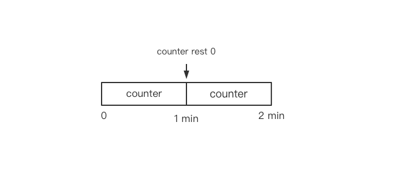
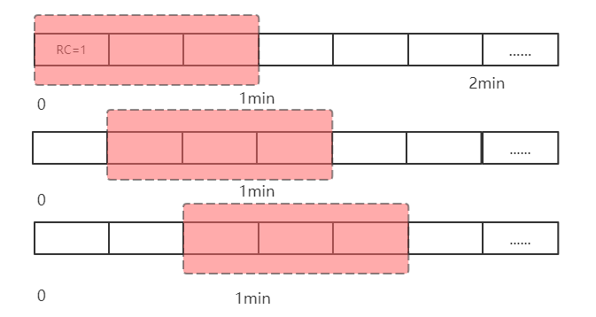
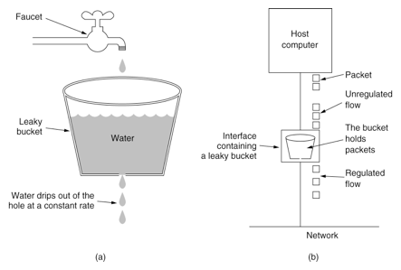
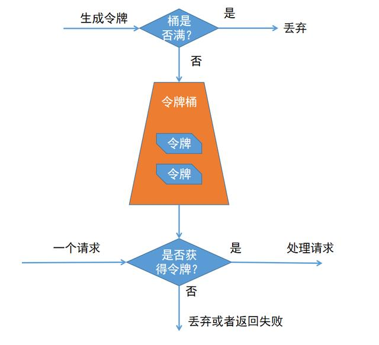

## [滑动窗口算法详解](../README.md)

- [滑动窗口算法详解](#[滑动窗口算法详解](../README.md))
- [更新日志](#更新日志)
- [计数器法](#一-计数器法)
- [滑动时间窗算法](#二-滑动时间窗算法)
- [漏桶算法](#三-漏桶算法)
- [令牌桶算法](#四-令牌桶算法)

# 更新日志

| 文档版本   |  更新说明  |更新时间 | 更新人 |
| ---------|-------|-------|------------ |
| v1.0.0  | 滑动时间窗口算法基本原理以及实现 | 2021/4/20 | 张子尧 |

### 一 计数器法

​	计数器法是限流算法中最简单也是最容易实现的一种算法。比如规定接口一分钟访问次数不能超过100个，那么可以设置一个全局计数器counter，每次过来一个请求counter加1，如果在一分钟内counter值大于100，则对请求进行限流，如果在间隔时间内请求没有超过100，则重置counter。

<br/>



代码实现：

```java
/**
 * 限流算法-计数器法
 *
 * @author zhangziyao
 * @date 2021/5/7
 */
public class Counter {
    public long timestamp = System.currentTimeMillis();//当前时间
    public int RC = 0;//计数器
    public final int limit = 100;//最大请求阈值
    public final long timeWindow = 60 * 1000;//时间窗口 ms

    public boolean limiting() {
        long now = System.currentTimeMillis();
        if (now < timestamp + timeWindow) {
            RC++;
            // Determine whether the request has reached the threshold
            return RC <= limit;
        } else {
            timestamp = now;
            //rest RC
            RC = 1;
            return true;
        }
    }
}
```

### 二 滑动时间窗算法

​	算法思想：将时间窗口划分为更小的时间片段，每过一个时间片段，时间窗口会滑动一格，每个时间片段都有独立的计数器，在计算时把整个时间窗口的请求总数和所有时间片段的计数器进行累加，解决了计数器法统计精度的问题。时间窗口划分越细，限流统计会越精确。


	如上图，一个时间窗就是一分钟，然后我们对时间窗口进行划分，如图我们将滑动窗口划分为3个格子，每个格子就为20秒，每过20秒时间窗口就会向右滑动一格。每个格子都会有自己独立的计数器`RC`。

代码实现：

```java
package com.kiss.limiting;
import java.util.LinkedList;
import java.util.Random;
/**
 * 限流算法-滑动时间窗
 *
 * @author zhangziyao
 * @date 2021/5/7
 */
public class SlidingTimeWindow {
    public long RC = 0;//每个格子访问量计数器
    LinkedList<Long> slots = new LinkedList<>();//时间窗格集合
    public boolean flag = false;//限流标记
    public static void main(String[] args) throws InterruptedException {
        SlidingTimeWindow stw = new SlidingTimeWindow();
        new Thread(() -> {
            try {
                stw.check();
            } catch (InterruptedException e) {
                e.printStackTrace();
            }
        }).start();
        while (true) {
            //TODO 判断限流标记
            if (stw.flag) {
                System.out.println("slow down!!!");
            } else {
                System.out.println("start");
            }
            stw.RC++;
            Thread.sleep(new Random().nextInt(15));
        }
    }
    public void check() throws InterruptedException {
        while (true) {
            slots.addLast(RC);
            if (slots.size() > 3) {
                slots.removeFirst(); //Delete the first time pane
            }
            long counter = (slots.peekLast() == null ? 0 : slots.peekLast()) - (slots.peekFirst() == null ? 0 : slots.peekFirst());
            if (counter > 500) {
                //Trigger current limiting
                flag = true;
            } else {
                flag = false;
            }
            Thread.sleep(2 * 1000);
        }
    }
}
```

### 三 漏桶算法

​	漏桶算法（`Leaky Bucket`），请求先进入漏桶中，漏桶以一定的速度出水（响应速率），当水流的速度过大会直接溢出，也就是访问的速率大于响应的速率，然后拒绝之后的请求，可以看出漏桶算法能强行限制数据的传输速率.示意图如下:




​	可见这里有两个变量,一个是桶的大小,支持流量突发增多时可以存多少的水(burst),另一个是水桶漏洞的大小(rate)，伪代码如下：

```java
/**
 * 限流算法-漏桶算法
 *
 * @author zhangziyao
 * @date 2021/5/8
 */
public class LeakyBucket {
    public long timestamp = System.currentTimeMillis(); // current time
    public long capacity = 500; // leakage of copper capacity
    public long rate = 50; // water velocity (second)
    public long water; // the current water

    public boolean limit() {
        long now = System.currentTimeMillis();
        // First implement the leak, calculate the remaining water
        water = Math.max(0, water - ((now - timestamp) / 1000) * rate);
        timestamp = now;
        if (water + 1 < capacity) {
            // under the water , try to add water
            water += 1;
            return false;
        } else {
            // water drop , refused to add water
            return true;
        }
    }
}
```

### 四 令牌桶算法

令牌桶算法：系统会以一定的速率往桶里添加令牌，处理请求前，则需要先从桶里获取一个令牌，当桶里没有令牌可取时，则返回失败。



+ 所有的请求在处理之前都需要拿到一个可用的令牌才会被处理；
+ 获取不到令牌，则请求返回失败；
+ 根据限流大小，设置按照一定的速率往桶里添加令牌；
+ 桶设置最大的放置令牌限制，当桶满时、新添加的令牌就被丢弃或者拒绝；

具体实现：

```java
/**
 * @author zhangziyao
 * @date 2021/5/8
 */
public class TokenBucket {
    public long timestamp = System.currentTimeMillis(); // current time
    public long capacity; // leakage of copper capacity
    public long rate; // get token velocity (second)
    public long tokens; // the current token

    public boolean grant() {
        long now = System.currentTimeMillis();
        // add token to bucket
        tokens = Math.min(capacity, tokens + (now - timestamp) * rate);
        timestamp = now;
        if (tokens < 1) {
            // 若不到1个令牌,则拒绝
            return false;
        } else {
            // 还有令牌，领取令牌
            tokens -= 1;
            return true;
        }
    }
}
```

