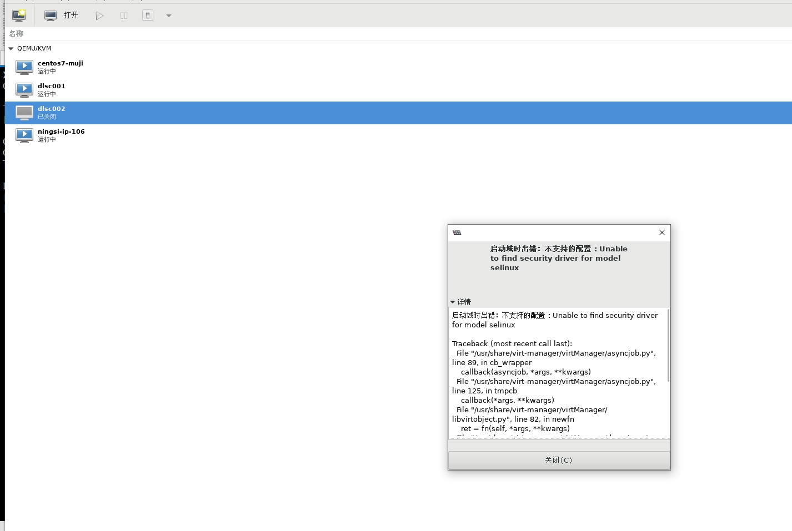
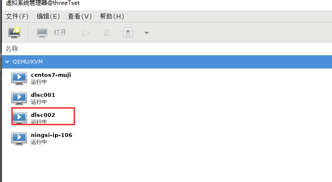
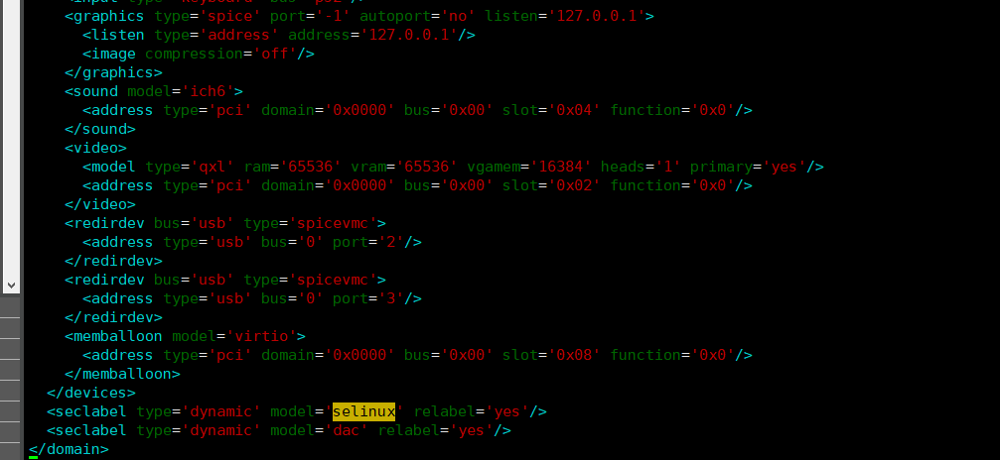

# [KVM启动异常解决方案](../README.md)

- [KVM启动异常解决方案](#[KVM启动异常解决方案](../README.md))
- [更新日志](#更新日志)
- [一 问题描述](#一-问题描述)
- [二 解决方案](#二-解决方案)
    - [1 修改物理机SELINUX](#1-修改物理机SELINUX)
    - [2 修改虚拟机配置](#2-修改虚拟机配置)

# 更新日志

| 文档版本|   系统   |  更新说明  |更新时间 | 更新人 |
| ---------|-------|-------|-------|------------ |
| v1.0.0|  **centos**  | kvm启动异常解决方案 | 2021/4/20 | 张子尧 |

# 一 问题描述

 在`CentOS`系统中安装`KVM`的虚拟机，在停电启动时报错：恢复域出错：unsupported configuration: Unable to find security driver for label
selinux...libvirtError: unsupported configuration: Unable to find security driver for label selinux。

详细日志如下：

```

恢复域出错: unsupported configuration: Unable to find security driver for label selinux
 
Traceback (most recent call last):
  File "/usr/share/virt-manager/virtManager/asyncjob.py", line 44, in cb_wrapper
    callback(asyncjob, *args, **kwargs)
  File "/usr/share/virt-manager/virtManager/asyncjob.py", line 65, in tmpcb
    callback(*args, **kwargs)
  File "/usr/share/virt-manager/virtManager/domain.py", line 1125, in startup
    self._backend.create()
  File "/usr/lib64/python2.6/site-packages/libvirt.py", line 686, in create
    if ret == -1: raise libvirtError ('virDomainCreate() failed', dom=self)
libvirtError: unsupported configuration: Unable to find security driver for label selinux
```



# 二 解决方案

## 1 修改物理机SELINUX

修改物理机中的`SELINUX`配置，编辑`/etc/sysconfig/selinux`文件中的SELINUX配置，注释掉（selinux=disabled）

```sh
[root@test001 usr]# vim /etc/sysconfig/selinux

# This file controls the state of SELinux on the system.
# SELINUX= can take one of these three values:
#     enforcing - SELinux security policy is enforced.
#     permissive - SELinux prints warnings instead of enforcing.
#     disabled - No SELinux policy is loaded.
#SELINUX=disabled 
SELINUX=enforcing
# SELINUXTYPE= can take one of three values:
#     targeted - Targeted processes are protected,
#     minimum - Modification of targeted policy. Only selected processes are protected. 
#     mls - Multi Level Security protection.
SELINUXTYPE=targeted
```

修改保存后，reboot重启物理机，启动VM正常


## 2 修改虚拟机配置

如果有特殊情况物理机必须关闭selinux，则该方案能在不修改物理机selinux的情况下完成虚拟机启动。首先进入到问题机的配置文件下。kvm默认配置文件存放目录`/etc/libvirt/qemu/`
。配置文件命名回合虚拟机名相同，找到对应的配置文件进行修改。


```sh
<!--
WARNING: THIS IS AN AUTO-GENERATED FILE. CHANGES TO IT ARE LIKELY TO BE
OVERWRITTEN AND LOST. Changes to this xml configuration should be made using:
  virsh edit test002
or other application using the libvirt API.
......
    <video>
      <model type='qxl' ram='65536' vram='65536' vgamem='16384' heads='1' primary='yes'/>
      <address type='pci' domain='0x0000' bus='0x00' slot='0x02' function='0x0'/>
    </video>
    <redirdev bus='usb' type='spicevmc'>
      <address type='usb' bus='0' port='2'/>
    </redirdev>
    <redirdev bus='usb' type='spicevmc'>
      <address type='usb' bus='0' port='3'/>
    </redirdev>
    <memballoon model='virtio'>
      <address type='pci' domain='0x0000' bus='0x00' slot='0x08' function='0x0'/>
    </memballoon>
  </devices>
  <seclabel type='dynamic' model='dac' relabel='yes'/>
</domain>
```

删除带有selinux的配置执行`virsh define ./test002.xml`重新定义配置文件

```sh
[root@threeTset qemu]# virsh define ./test002.xml
定义域 test002（从 ./test002.xml）
```

重新启动虚拟机即可恢复正常.


