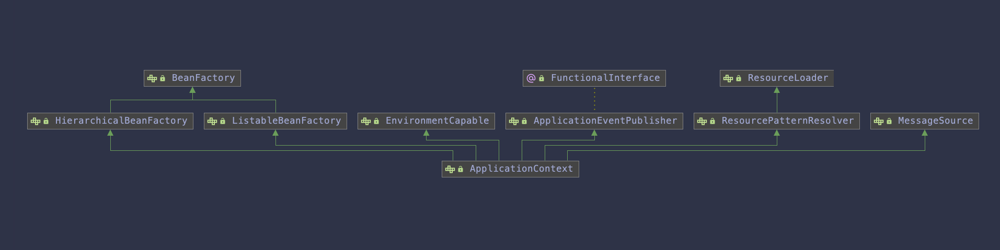

# [SpringIoc设计与实现原理](../README.md)

# 一 开篇

​	很早之前就想着要编写一些spring源码的介绍和读完spring源码的心得了，总是一拖再拖，琐事缠身……

# 二 IOC容器

## 1 spring IOC容器和Bean介绍

​		众所周知，spring有两大核心`IOC (Inversion of Control)`和`AOP`，本章就主要介绍IOC容器。控制反转是面向对象编程的一种设计原则，可以降低代码之间的耦合度。其中最常见的方式叫做依赖注入`(Dependency Injection，简称DI)`，还有一种方式叫“依赖查找”（Dependency Lookup）。通过控制反转，对象在被创建的时候，由一个调控系统内所有对象的外界实体将其所依赖的对象的引用传递给它。也可以说，依赖被注入到对象中。

​		IoC实际遵循的是DIP依赖倒置原则，上层模块不应该依赖于低层模块，二者应该通过抽象来依赖。Ioc把程序上层对下层的依赖转移到了第三方容器进行管理装配。

依赖注入三种方式：

+ 构造函数注入
+ 属性注入
+ 方法注入

​		`Bean`和`context`是实现spring ioc容器框架的基础，`BeanFactory`是spring的一个顶层核心接口，是一个工厂接口，负责生产Bean，该接口提供了一种更先进的配置机制来管理任意类型的对象。与之相对应的`ApplicationContext`则是`BeanFactory`的子接口。相对于`BeanFactory`来说，`ApplicationContext`则更加全面，它提供了：

- 与spring的aop特性集成

- 消息资源处理（国际化）

- 事件发布

- 应用层特定的上下文，比如WebApplicationContext等

  简而言之，`BeanFactory`只提供了基本功能，而`ApplicationContext`则是做了很多扩展，以及添加了更多的特定功能。

## 2 容器概述

​		`ApplicationContext`是spring ioc容器实现的代表，他负责实例化，配置合格柱状`Bean`。容器通过读取配置元数据获取有关实例化，配置和组装那些对象的说明。配置元数据可以通过xml、注解以及Java代码来实现。是允许存在对象之间相互依赖的关系。



​		`Spring`提供了`Application`接口的几个实现。通常创建建`ClassPathXmlApplicationContext`或者`AnnotationConfigApplicationContext`等实例。

**`ClassPathXmlApplicationContext`**是通过配置文件的形象注入Bean：

~~~xml
<?xml version="1.0" encoding="UTF-8"?>
<beans xmlns="http://www.springframework.org/schema/beans"
    xmlns:xsi="http://www.w3.org/2001/XMLSchema-instance"
    xsi:schemaLocation="http://www.springframework.org/schema/beans
        http://www.springframework.org/schema/beans/spring-beans.xsd">

    <bean id="..." class="...">
        <!-- collaborators and configuration for this bean go here -->
    </bean>
    <bean id="..." class="...">
        <!-- collaborators and configuration for this bean go here -->
    </bean>
    <!-- more bean definitions go here -->
</beans>
~~~

**`AnnotationConfigApplicationContext`**是通过配置文件的形象注入Bean：

~~~java
@Component
@Repository
@Service
@Controller
@ResController
~~~

## 3 BeanFactory

​	`BeanFactory`API为springioc提供了基础功能，它的特定契约主要用于与Spring的其他部分和相关的第三方框架集成其`DefaultListableBeanFactory`实现是更高级别`GenericApplicationContext`容器中的密钥委托。

​	`BeanFactory`和相关接口（例如BeanFactoryAware，InitializingBean）是其他框架组件的重要集成点，通过不需要任何注解或反射，是允许容器与其他组件的交互。

​	请注意，核心`BeanFactory` API级别及其 `DefaultListableBeanFactory`实现不会对配置格式或要使用的任何组件注解做出假设。 所有这些风格都通过扩展（例如`XmlBeanDefinitionReader`和`AutowiredAnnotationBeanPostProcessor`）进行，并作为核心元数据表示在共享`BeanDefinition`对象上运行。 

## 4 BeanFactory和ApplicationContext

​	您应该使用`ApplicationContext`，除非您有充分的理由不这样做，使用`GenericApplicationContext`及其子类`AnnotationConfigApplicationContext`作为自定义引导的常见实现。 这些是Spring用于所有常见目的的核心容器的主要入口点：加载配置文件，触发类路径扫描，以编程方式注册bean定义和带注解的类，以及（从5.0开始）注册功能bean定义。

​	因为`ApplicationContext`包括`BeanFactory`的所有功能，和`BeanFactory`相比更值得推荐，除了一些特定的场景，例如在资源受限的设备上运行的内嵌的应用。 在`ApplicationContext`（例如`GenericApplicationContext`实现）中，按照约定（即通过bean名称或bean类型 - 特别是后处理器）检测到几种bean， 而普通的`DefaultListableBeanFactory`对任何特殊bean都是不可知的。

​	对于许多扩展容器功能，例如注解处理和AOP代理， `BeanPostProcessor`扩展点是必不可少的。如果仅使用普通的`DefaultListableBeanFactory`，则默认情况下不会检测到并激活此类后置处理器。 这种情况可能令人困惑，因为您的bean配置实际上没有任何问题。 相反，在这种情况下，容器需要至少得多一些额外的处理。

下表列出了`BeanFactory`和`ApplicationContext`接口和实现提供的功能。

| 特征                                 | `BeanFactory` | `ApplicationContext` |
| ------------------------------------ | ------------- | -------------------- |
| Bean Bean实例化/装配                 | Yes           | Yes                  |
| 集成的生命周期管理                   | No            | Yes                  |
| 自动注册 `BeanPostProcessor`         | No            | Yes                  |
| 自动注册 `BeanFactoryPostProcessor`  | No            | Yes                  |
| 便利的 `MessageSource` 访问 (国际化) | No            | Yes                  |
| 内置`ApplicationEvent` 发布机制      | No            | Yes                  |

如果使用`	DefaultListableBeanFactory`注册Bean后置处理器，需要调用它的`addBeanPostProcessor`方法，例如：

~~~java
DefaultListableBeanFactory factory = new DefaultListableBeanFactory();
//注册BeanPostProcessor的实例
factory.addBeanPostProcessor(new MyBeanPostProcessor());
~~~

如果要注册`BeanFactoryPostProcessor`需要调用`postProcessorBeanFactory`方法。例如:

```JAVA
DefaultListableBeanFactory factory = new DefaultListableBeanFactory();
XmlBeanDefinitionReader reader = new XmlBeanDefinitionReader(factory);
reader.loadBeanDefinitions(new FileSystemResource("beans.xml"));

// bring in some property values from a Properties file
PropertyPlaceholderConfigurer cfg = new PropertyPlaceholderConfigurer();
cfg.setLocation(new FileSystemResource("jdbc.properties"));

// now actually do the replacement
cfg.postProcessBeanFactory(factory);
```

​	在这两种情况下，注册步骤都不方便，这就是为什么各种`ApplicationContext`变体优先于Spring支持的应用程序中的普通`DefaultListableBeanFactory`， 尤其是在典型企业设置中依赖`BeanFactoryPostProcessor` 和 `BeanPostProcessor`实例来扩展容器功能时。

​	`AnnotationConfigApplicationContext`具有注册的所有常见注解后置处理器，并且可以通过配置注解（例如`@EnableTransactionManagement`）在封面下引入其他处理器。 在Spring的基于注解的配置模型的抽象级别，bean的后置处理器的概念变成仅仅是内部容器细节。[**`注：文档参考spring官方文档`**](https://spring.io/)


