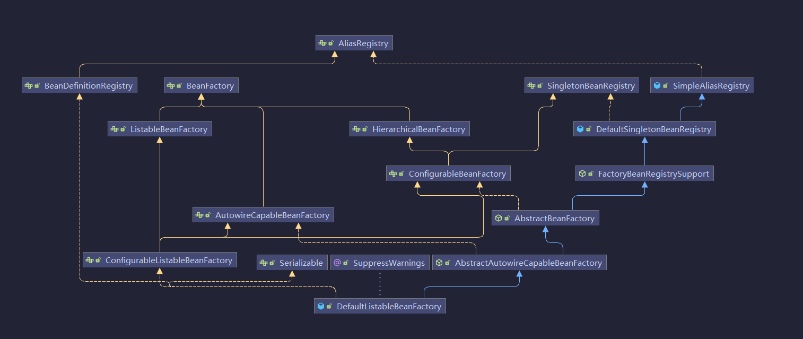
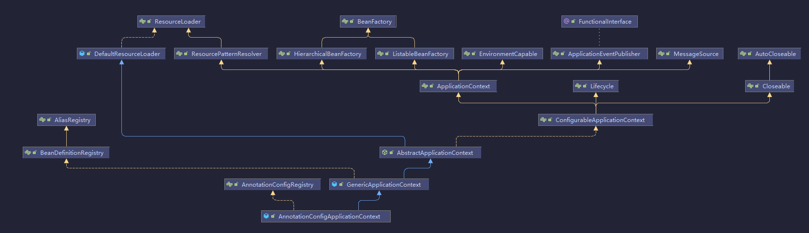
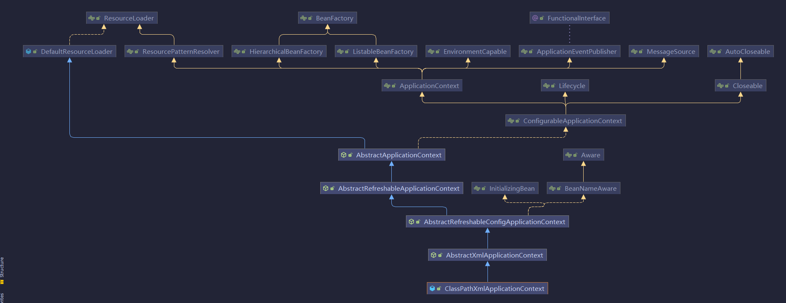

# [Spring核心类概念解析](../README.md)

- [Spring核心类概念解析](#[Spring核心类概念解析](../README.md))

# 一 简介

| 文档版本|   版本   |  更新说明  |更新时间 | 更新人 |
| ---------|-------|-------|-------|------------ |
| v1.0.0|  **spring 5.3.x**  | bean定义介绍 | 2021/9/16 | 张子尧 |
| v1.0.0|  **spring 5.3.x**  | spring容器简介 | 2021/9/07 | 张子尧 |
| v1.0.0|  **spring 5.3.x**  | 类型转换器 | 2021/9/13 | 张子尧 |
| v1.0.0|  **spring 5.3.x**  | spring提供的工具类 | 2021/9/16 | 张子尧 |


## 1 BeanDefinition

​	在spring中`BeanDefinition`是一个很核心的类，，是用来表示Bean定义，`BeanDefinition`中存在很多属性用来白搜狐Bean的特点。比如：


| 属性名            | 含义                                                 |
| ----------------- | ---------------------------------------------------- |
| beanClass         | 表示bean的类型                                       |
| scope             | 表示bean的作用域，比如单例、原型、session、request等 |
| lazyInit          | 表示是否为懒加载                                     |
| initMethodName    | 初始化时要执行的方法                                 |
| destroyMethodName | 销毁时要执行的方法                                   |
| propertyValues    | 属性赋值                                             |
| ......            | ......                                               |

在spring中，通常会使用<bean/>、@Bean、@Component、@Service、@Controller等来定义Bean。这种方式也被称之为**申明式定义Bean。**

我们也可以通过编程的方式来定义Bean，直接通过BeanDefinition来定义bean。

~~~java
AnnotationConfigApplicationContext context = new AnnotationConfigApplicationContext(Config.class);
//生成一个BeanDefinition对象，并把我们准备好的对象赋值给BeanDefinition注册到容器中
AbstractBeanDefinition beanDefinition = BeanDefinitionBuilder.genericBeanDefinition().getBeanDefinition();
beanDefinition.setBeanClass(Cat.class);
context.registerBeanDefinition("cat", beanDefinition);
System.out.println(context.getBean("cat"));
//可以看出我们通过这种方式也可以拿到bean。
//我们还可以通过Beandefinition设置Bean的其他属性
beanDefinition.setScope("prototype"); // 设置作用域
beanDefinition.setInitMethodName("init"); // 设置初始化方法
beanDefinition.setLazyInit(true); // 设置懒加载
~~~

通过以上方式定义的Bean最终都会被spring解析成对应的BeanDefinition对象，并放入Spring容器中。

## 2 BeanDefinitionReader

在源码中我们可以看出Spring为我们提供了几种BeanDefinition读取器`BeanDefinitionReader`，这些读取器我们平时用的很少，但是在整个spring体系中应用的是非常多的，相当于spring源码中的基础设施。

### 2.1 AnnotatedBeanDefinitionReader

可以把类直接转化为BeanDefinition，并解析该类上的注解。

~~~java
ApplicationContext context = new AnnotationConfigApplicationContext(AppConfig.class);
AnnotatedBeanDefinitionReader reader = new AnnotatedBeanDefinitionReader(context);
// 将User.class解析为BeanDefinition
reader.register(User.class);
System.out.println(context.getBean("cat"));
~~~

注意：它能解析的注解是：@Conditional，**@Scope**、@Lazy、@Primary、@DependsOn、@Role、@Description

### 2.2 XmlBeanDefinitionReader

可以解析<bean/>标签

~~~java
ApplicationContext context = new AnnotationConfigApplicationContext(AppConfig.class);

XmlBeanDefinitionReader xmlBeanDefinitionReader = new XmlBeanDefinitionReader(context);
int i = xmlBeanDefinitionReader.loadBeanDefinitions("spring.xml");
System.out.println(context.getBean("cat"));
~~~

## 3 ClassPathBeanDefinitionScanner

ClassPathBeanDefinitionScanner是扫描器，但是它的作用和BeanDefinitionReader类似，它可以进行扫描，扫描某个包路径，对扫描到的类进行解析，比如，扫描到的类上如果存在@Component注解，那么就会把这个类解析为一个BeanDefinition，比如：

~~~java
ApplicationContext context = new AnnotationConfigApplicationContext();
context.refresh();
ClassPathBeanDefinitionScanner scanner = new ClassPathBeanDefinitionScanner(context);
scanner.scan("com.spring");
System.out.println(context.getBean("userService"));
~~~

## 4 BeanFactory

BeanFactory表示Bean**工厂**，所以很明显，BeanFactory会负责创建Bean，并且提供获取Bean的API。

而ApplicationContext是BeanFactory的一种，在Spring源码中，是这么定义的：

~~~java
public interface ApplicationContext extends EnvironmentCapable, ListableBeanFactory, HierarchicalBeanFactory,
		MessageSource, ApplicationEventPublisher, ResourcePatternResolver {

            ...
}
~~~

​	首先，在java中，接口是可以多继承的，我们发现ApplicationContext集成了ListableBeanFactory和HierarchicalBeanFactory，而ListableBeanFactory和HierarchicalBeanFactory都继承至BeanFactory，所以我们可以认为ApplicationContext继承了BeanFactory，ApplicationContext也是BeanFactory的一种。

​	拥有BeanFactory支持的所有功能，不过ApplicationContext比BeanFactory更加强大，ApplicationContext还基础了其他接口，也就表示ApplicationContext还拥有其他功能，比如MessageSource表示国际化，ApplicationEventPublisher表示事件发布，EnvironmentCapable表示获取环境变量等等。

`DefaultListableBeanFactory`是一个功能很强大的BeanFactory的实现，支持很多功能。



看了看出这个类实现了很多接口：

1. AliasRegistry：支持别名，一个bean可以对应很多别名
2. BeanFactory：支持bean工厂的所有功能
3. ListableBeanFactory：能获取所有BeanDefinition的beanNames，可以根据某个类型获取对应的beanNames等
4. BeanDefinitionRegistry：支持注册、保存、删除、获取Bean定义
5. HierarchicalBeanFactory：在BeanFactory的基础上，添加了获取父BeanFactory的功能
6. DefaultSingletonBeanRegistry：它是一个类，实现了SingletonBeanRegistry接口，拥有了直接注册、获取某个单例Bean的功能
7. FactoryBeanRegistrySupport：支持factoryBean功能
8. DefaultListableBeanFactory：继承了AbstractAutowireCapableBeanFactory，实现了ConfigurableListableBeanFactory接口和BeanDefinitionRegistry接口，所以DefaultListableBeanFactory的功能很强大。

其他的就不做介绍了，总之来说`DefaultListableBeanFactory`的功能是非常强大的

## 5 ApplicationContext

上面有分析到，ApplicationContext是个接口，实际上也是一个BeanFactory，不过比BeanFactory更加强大，比如：

1. HierarchicalBeanFactory：拥有获取父BeanFactory的功能
2. ListableBeanFactory：拥有获取beanNames的功能
3. ResourcePatternResolver：资源加载器，可以一次性获取多个资源（文件资源等等）
4. EnvironmentCapable：可以获取运行时环境（没有设置运行时环境功能）
5. ApplicationEventPublisher：拥有广播事件的功能（没有添加事件监听器的功能）
6. MessageSource：拥有国际化功能

对于`ApplicationContxt`有两个重要的实现类。分别是`AnnotationConfigApplicationContext`和`ClassPathXmlApplicationContext`。

### 5.1 AnnotationConfigApplicationContext



1. ConfigurableApplicationContext：继承了ApplicationContext接口，增加了，添加事件监听器、添加BeanFactoryPostProcessor、设置Environment，获取ConfigurableListableBeanFactory等功能
2. AbstractApplicationContext：实现了ConfigurableApplicationContext接口
3. GenericApplicationContext：继承了AbstractApplicationContext，实现了BeanDefinitionRegistry接口，拥有了所有ApplicationContext的功能，并且可以注册BeanDefinition，注意这个类中有一个属性(DefaultListableBeanFactory **beanFactory**)
4. AnnotationConfigRegistry：可以单独注册某个为类为BeanDefinition（可以处理该类上的**@Configuration注解**，已经可以处理**@Bean注解**），同时可以扫描
5. AnnotationConfigApplicationContext：继承了GenericApplicationContext，实现了AnnotationConfigRegistry接口，拥有了以上所有的功能

### 5.2 ClassPathXmlApplicationContext



它也是继承了AbstractApplicationContext，但是相对于AnnotationConfigApplicationContext而言，功能没有AnnotationConfigApplicationContext强大，比如不能注册BeanDefinition

## 6 国际化

定义`MessageSource`：

~~~java
@Bean
public MessageSource messageSource(){
    ResourceBundleMessageSource messageSource = new ResourceBundleMessageSource();
	messageSource.setBasename("messages");
	return messageSource;
}
//注册了这个Bean之后，就可以想要使用的地方进行国际化处理了，上面可以看到ApplicationContext也拥有国际化的功能
context.getMessage("test", null, new Locale("en_CN"))
~~~

## 7 资源加载

ApplicationContext还拥有资源加载的功能，比如可以直接利用getResource()获取资源

~~~java
ApplicationContext context = new AnnotationConfigApplicationContext(AppConfig.class);
Resource resource = context.getResource("file://D：\\test.txt");
System.out.println(resource.getFilename());
//获取网络资源
Resource resource1 = context.getResource("https://www.baidu.com");
System.out.println(resource1.getURL());
//比较常见的获取类路径的资源
Resource resource2 = context.getResource("classpath:spring.xml");
System.out.println(resource2.getURL());
//获取多个资源
Resource[] resources = context.getResources("classpath:com/*.class");
for (Resource resource : resources) {
	System.out.println(resource.getFilename());
}
~~~

## 8 获取运行时环境

~~~java
ApplicationContext context = new AnnotationConfigApplicationContext(AppConfig.class);

Map<String, Object> systemEnvironment = context.getEnvironment().getSystemEnvironment();
System.out.println(systemEnvironment);

System.out.println("=======");

Map<String, Object> systemProperties = context.getEnvironment().getSystemProperties();
System.out.println(systemProperties);

System.out.println("=======");

MutablePropertySources propertySources = context.getEnvironment().getPropertySources();
System.out.println(propertySources);

System.out.println("=======");

System.out.println(context.getEnvironment().getProperty("NO_PROXY"));
System.out.println(context.getEnvironment().getProperty("sun.jnu.encoding"));
//我们可以通过注解@propertySource注解来把某个配置文件中的参数加到运行时环境中
~~~

## 9 事件发布

先定义一个事件监听器

```java
@Bean
public ApplicationListener applicationListener() {
	return new ApplicationListener() {
		@Override
		public void onApplicationEvent(ApplicationEvent event) {
			System.out.println("接收到了一个事件");
		}
	};
}
//发布事件
context.publishEvent("kkk");
```

## 10 类型转换

在Spring源码中，有可能需要把String转成其他类型，所以在Spring源码中提供了一些技术来更方便的做对象的类型转化。

### 10.1 PropertyEditor

PropertyEditor是JDK提供的类型转换工具

~~~java
public class StringToUserPropertyEditor extends PropertyEditorSupport implements PropertyEditor {

	@Override
	public void setAsText(String text) throws IllegalArgumentException {
		User user = new User();
		user.setName(text);
		this.setValue(user);
	}
}
//测试
StringToUserPropertyEditor propertyEditor = new StringToUserPropertyEditor();
propertyEditor.setAsText("1");
User value = (User) propertyEditor.getValue();
System.out.println(value);
//向spring注册类型转换器

@Bean
public CustomEditorConfigurer customEditorConfigurer() {
	CustomEditorConfigurer customEditorConfigurer = new CustomEditorConfigurer();
	Map<Class<?>, Class<? extends PropertyEditor>> propertyEditorMap = new HashMap<>();
    // 表示StringToUserPropertyEditor可以将String转化成User类型，在Spring源码中，如果发现当前对象是String，而需要的类型是User，就会使用该PropertyEditor来做类型转化
	propertyEditorMap.put(User.class, StringToUserPropertyEditor.class);
	customEditorConfigurer.setCustomEditors(propertyEditorMap);
	return customEditorConfigurer;
}
~~~

假设现在有如下Bean:

```java
@Component
public class UserService {

	@Value("xxx")
	private User user;

	public void test() {
		System.out.println(user);
	}
}
```

### 10.2 ConversionService

Spring中提供的类型转化服务，它比PropertyEditor更强大

```java
public class StringToUserConverter implements ConditionalGenericConverter {

	@Override
	public boolean matches(TypeDescriptor sourceType, TypeDescriptor targetType) {
		return sourceType.getType().equals(String.class) && targetType.getType().equals(User.class);
	}

	@Override
	public Set<ConvertiblePair> getConvertibleTypes() {
		return Collections.singleton(new ConvertiblePair(String.class, User.class));
	}

	@Override
	public Object convert(Object source, TypeDescriptor sourceType, TypeDescriptor targetType) {
		User user = new User();
		user.setName((String)source);
		return user;
	}
}
DefaultConversionService conversionService = new DefaultConversionService();
conversionService.addConverter(new StringToUserConverter());
User value = conversionService.convert("1", User.class);
System.out.println(value);
```

如何向Spring中注册ConversionService：

```java
@Bean
public ConversionServiceFactoryBean conversionService() {
	ConversionServiceFactoryBean conversionServiceFactoryBean = new ConversionServiceFactoryBean();
	conversionServiceFactoryBean.setConverters(Collections.singleton(new StringToUserConverter()));

	return conversionServiceFactoryBean;
}
```

### 10.3 TypeConverter

整合了PropertyEditor和ConversionService的功能，是Spring内部用的

```java
SimpleTypeConverter typeConverter = new SimpleTypeConverter();
typeConverter.registerCustomEditor(User.class, new StringToUserPropertyEditor());
//typeConverter.setConversionService(conversionService);
User value = typeConverter.convertIfNecessary("1", User.class);
System.out.println(value);
```

## 11 OrderComparator

OrderComparator是Spring所提供的一种比较器，可以用来根据@Order注解或实现Ordered接口来执行值进行笔记，从而可以进行排序。比较常见是就是

~~~java
//实现Ordered接口
//使用@Order注解
//实现PriorityOrdered接口
~~~

## 12 BeanPostProcessor

BeanPostProcess表示Bena的后置处理器，我们可以定义一个或多个BeanPostProcessor，比如通过一下代码定义一个BeanPostProcessor：

```java
@Component
public class MyBeanPostProcessor implements BeanPostProcessor {
	@Override
	public Object postProcessBeforeInitialization(Object bean, String beanName) throws BeansException {
		if ("userService".equals(beanName)) {
			System.out.println("初始化前");
		}
		return bean;
	}

	@Override
	public Object postProcessAfterInitialization(Object bean, String beanName) throws BeansException {
		if ("userService".equals(beanName)) {
			System.out.println("初始化后");
		}

		return bean;
	}
}
```

一个BeanPostProcessor可以在**任意一个Bean**的**初始化之前**以及**初始化之后**去额外的做一些用户自定义的逻辑，当然，我们可以通过判断beanName来进行针对性处理（针对某个Bean，或某部分Bean）。

我们可以通过定义BeanPostProcessor来干涉Spring创建Bean的过程。

## 13 BeanFactoryPostProcessor

BeanFactoryPostProcessor表示Bean工厂的后置处理器，其实和BeanPostProcessor类似，BeanPostProcessor是干涉Bean的创建过程，BeanFactoryPostProcessor是干涉BeanFactory的创建过程。比如，我们可以这样定义一个BeanFactoryPostProcessor：

```java
@Component
public class ZhouyuBeanFactoryPostProcessor implements BeanFactoryPostProcessor {

	@Override
	public void postProcessBeanFactory(ConfigurableListableBeanFactory beanFactory) throws BeansException {
		System.out.println("加工beanFactory");
	}
}
```

我们可以在postProcessBeanFactory()方法中对BeanFactory进行加工。

## 14 FactoryBean

上面提到，我们可以通过BeanPostPorcessor来干涉Spring创建Bean的过程，但是如果我们想一个Bean完完全全由我们来创造，也是可以的，比如通过FactoryBean：

```java
@Component
public class MyFactoryBean implements FactoryBean {
	@Override
	public Object getObject() throws Exception {
		UserService userService = new UserService();
		return userService;
	}
	@Override
	public Class<?> getObjectType() {
		return UserService.class;
	}
}
```

通过上面这段代码，我们自己创造了一个UserService对象，并且它将成为Bean。但是通过这种方式创造出来的UserService的Bean，**只会经过初始化后**，其他Spring的生命周期步骤是不会经过的，比如依赖注入。

有同学可能会想到，通过@Bean也可以自己生成一个对象作为Bean，那么和FactoryBean的区别是什么呢？其实在很多场景下他俩是可以替换的，但是站在原理层面来说的，区别很明显，@Bean定义的Bean是会经过完整的Bean生命周期的。

## 15 ExcludeFilter和IncludeFilter

这两个Filter是Spring扫描过程中用来过滤的。ExcludeFilter表示**排除过滤器**，IncludeFilter表示**包含过滤器**。

比如以下配置，表示扫描com.zhouyu这个包下面的所有类，但是排除UserService类，也就是就算它上面有@Component注解也不会成为Bean。

```java
@ComponentScan(value = "com.spring",
		excludeFilters = {@ComponentScan.Filter(
            	type = FilterType.ASSIGNABLE_TYPE, 
            	classes = UserService.class)}.)
public class AppConfig {
}
```

再比如以下配置，就算UserService类上没有@Component注解，它也会被扫描成为一个Bean。

```java
@ComponentScan(value = "com.zhouyu",
		includeFilters = {@ComponentScan.Filter(
            	type = FilterType.ASSIGNABLE_TYPE, 
            	classes = UserService.class)})
public class AppConfig {
}
```

FilterType分为：

1. ANNOTATION：表示是否包含某个注解
2. ASSIGNABLE_TYPE：表示是否是某个类
3. ASPECTJ：表示否是符合某个Aspectj表达式
4. REGEX：表示是否符合某个正则表达式
5. CUSTOM：自定义

在Spring的扫描逻辑中，默认会添加一个AnnotationTypeFilter给includeFilters，表示默认情况下Spring扫描过程中会认为类上有@Component注解的就是Bean。

## 16 `MetadataReader、ClassMetadata、AnnotationMetadata`

在Spring中需要去解析类的信息，比如类名、类中的方法、类上的注解，这些都可以称之为类的元数据，所以Spring中对类的元数据做了抽象，并提供了一些工具类。

MetadataReader表示类的元数据读取器，默认实现类为**SimpleMetadataReader**。比如：

~~~java
public class Test {

	public static void main(String[] args) throws IOException {
		SimpleMetadataReaderFactory factory = new SimpleMetadataReaderFactory();
        // 构造一个MetadataReader
        MetadataReader metadataReader = factory.getMetadataReader("com.spring.UserService");
        // 得到一个ClassMetadata，并获取了类名
        ClassMetadata classMetadata = metadataReader.getClassMetadata();
	
        System.out.println(classMetadata.getClassName());
        
        // 获取一个AnnotationMetadata，并获取类上的注解信息
        AnnotationMetadata annotationMetadata = metadataReader.getAnnotationMetadata();
		for (String annotationType : annotationMetadata.getAnnotationTypes()) {
			System.out.println(annotationType);
		}

	}
}
~~~

需要注意的是，SimpleMetadataReader去解析类时，使用的**ASM技术**。

为什么要使用ASM技术，Spring启动的时候需要去扫描，如果指定的包路径比较宽泛，那么扫描的类是非常多的，那如果在Spring启动时就把这些类全部加载进JVM了，这样不太好，所以使用了ASM技术。